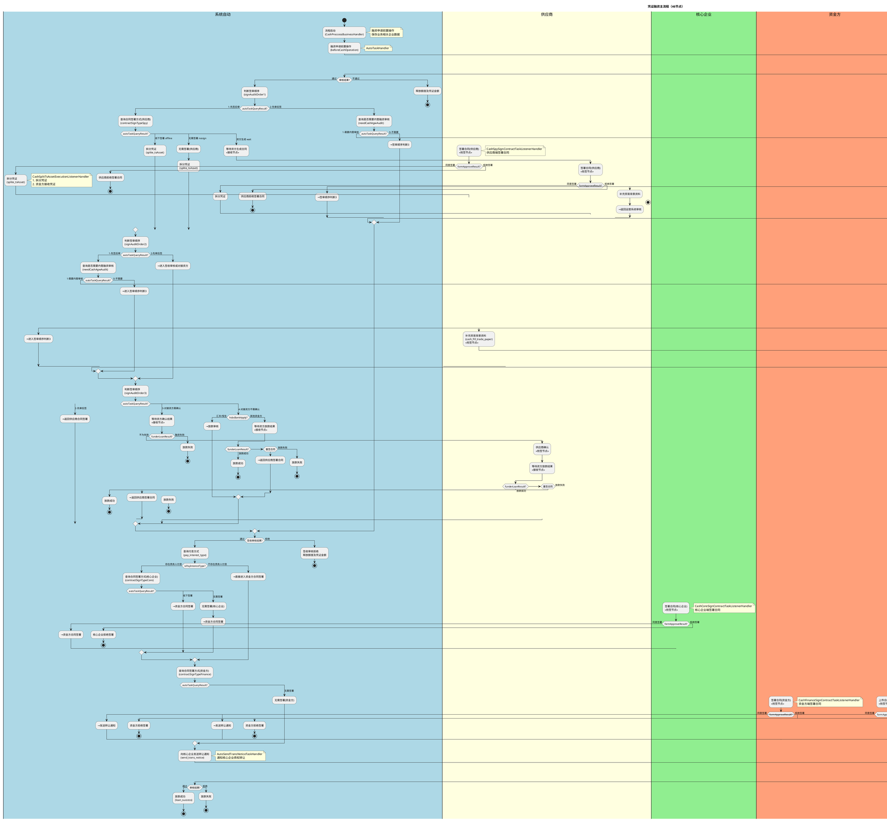

# 凭证融资业务文档

## 1. 业务概述

凭证融资是供应链金融平台的核心融资业务流程，允许供应商将持有的数字债权凭证向资金方（银行等金融机构）进行融资变现。该流程涉及供应商（融资方）、核心企业（债务人）、资金方（放款方）、内管端（运营中台）四方参与者，涵盖融资审核、三方合同签署（供应商/核心企业/资金方）、签收审核、放款审核和放款等关键环节。对接16家银行，是系统中最复杂的融资流程之一。

- **流程Key**: `Flow-76e3cd9427e6487eb1273eaba6a3deb2`
- **流程名称**: 凭证融资
- **节点数量**: 46个
- **复杂度**: 极高
- **主要参与方**: 供应商（融资方）、核心企业（债务人）、资金方（放款方）、内管端（运营中台）
- **对接银行**: 16家

## 2. 业务流程

### 2.1 业务流程图（PlantUML，含子流程平铺）



### 2.2 详细流程说明

#### 阶段一：流程启动与融资审核
1. 供应商发起凭证融资申请，触发 `CashProccessBusinessHandler`
2. 执行融资申请前置操作（`beforeCashOperation`），保存业务相关企业数据
3. 进入融资审核子流程（`MultiTrans-cash_apply_audit`），供应商端审核
4. 审核结果：通过→进入签审顺序判断；拒绝→释放额度和凭证金额

#### 阶段二：签审顺序判断（四种模式）
1. **模式1-先签后审**：供应商先签署合同 → 内管审核 → 签收审核
2. **模式2-先审后签**：内管审核 → 供应商签署合同 → 签收审核
3. **模式3-对接资方需确认**：供应商签署 → 等待资方确认 → 供应商确认 → 等待放款
4. **模式4-对接资方不需确认**：供应商签署 → 等待资方放款 / 汇丰银行放款审核

#### 阶段三：供应商合同签署
1. 查询合同签署方式（`contractSignTypeSpy`）
2. 支持四种模式：线上签署(online)、线下签署(offline)、无需签署(nosign)、资方生成合同等待(wait)
3. 线上签署完成后自动触发凭证拆分（`CashSplitTsAssetExecutionListenerHandler`）
4. 资方生成合同场景：先异步等待资方生成合同，再由供应商签署

#### 阶段四：内管融资审核
1. 判断是否需要内管审核（`needCashAgwAudit`）
2. 需要审核时推送运营中台（`beforePushToOpssOperation`）
3. 运营中台异步审核（`ReceiveTask-opsCheck`），支持通过/退回/拒绝
4. 退回时供应商补充贸易背景资料后重新提交

#### 阶段五：三方合同签署
1. **核心企业合同签署**：仅在存在债务人付息时需要核心企业签署合同
2. **资金方合同签署**：支持线上签署、线下签署、无需签署三种方式
3. 各方签署完成后向核心企业发送转让通知（`AutoSendTransNoticeTaskHandler`）

#### 阶段六：放款审核与放款
1. **直保放款审核**：资金方端审核（`Flow-9d716a3b7a7545e9bfbf58f34a82df98`）
2. **对接资方放款**：等待外部资方放款结果回调，支持放款成功/失败/重签合同
3. **汇丰银行特殊路径**：汇丰/恒生银行不经过资方等待节点，直接进入放款审核

## 3. 业务规则

### 3.1 凭证拆分规则
| 规则编号 | 规则描述 | 触发时机 |
|---------|---------|---------|
| R-CF-001 | 供应商签署合同后自动拆分凭证 | CashSplitTsAssetExecutionListenerHandler |
| R-CF-002 | 凭证拆分后资金方接收子凭证 | splitTsAsset → 资金方接收 |
| R-CF-003 | 融资审核拒绝时释放额度和凭证金额 | RejectAutoCleanTaskHandler |
| R-CF-004 | 签收审核拒绝时释放额度和凭证金额 | RejectAutoCleanTaskHandler |

### 3.2 签审顺序规则
| 规则编号 | 规则描述 | 条件值 |
|---------|---------|--------|
| R-CF-010 | 先签后审：供应商先签署→内管审核→签收审核 | autoTaskQueryResult = 1 |
| R-CF-011 | 先审后签：内管审核→供应商签署→签收审核 | autoTaskQueryResult = 2 |
| R-CF-012 | 对接资方需供应商确认：签署→资方确认→供应商确认→等待放款 | autoTaskQueryResult = 3 |
| R-CF-013 | 对接资方不需确认：签署→等待资方放款 | autoTaskQueryResult = 4 |

### 3.3 合同签署规则
| 规则编号 | 规则描述 | 条件 |
|---------|---------|------|
| R-CF-020 | 供应商合同签署：线上/线下/无需签署/资方生成 | autoTaskQueryResult = online/offline/nosign/wait |
| R-CF-021 | 核心企业合同签署仅在存在债务人付息时触发 | isPayInterestType = 1 |
| R-CF-022 | 资金方合同签署：线上/线下/无需签署 | autoTaskQueryResult = online/offline/nosign |
| R-CF-023 | 供应商/核心企业/资金方拒绝签署均可终止流程 | formApproveResult = reject |

### 3.4 银行对接规则
| 规则编号 | 规则描述 | 条件 |
|---------|---------|------|
| R-CF-030 | 汇丰/恒生银行不经过资方等待节点，直接进入放款审核 | hsbcBankApply = hsbc/hangseng |
| R-CF-031 | 其他资金方通过ReceiveTask异步等待放款结果 | hsbcBankApply = other |
| R-CF-032 | 资方放款结果支持：成功/失败/重签合同 | funderLoanResult = success/fail/contract_sign |
| R-CF-033 | 放款失败触发资源释放（RejectAutoCleanTaskHandler） | funderLoanResult = fail |

### 3.5 运营审核规则
| 规则编号 | 规则描述 | 条件 |
|---------|---------|------|
| R-CF-040 | 运营审核为异步模式，推送运营系统后等待回调 | ReceiveTask-opsCheck |
| R-CF-041 | 运营审核支持通过/退回/拒绝三种结果 | formApproveResult = pass/back/reject |
| R-CF-042 | 退回时供应商补充贸易背景资料后重新提交 | RushSignTask-cash_fill_trade_paper |

## 4. 接口说明/监听器说明

### 4.1 全局监听器

| 监听器 | 类型 | 说明 |
|--------|------|------|
| `CashProccessBusinessHandler` | 流程启动业务扩展 | 融资申请前置操作，保存业务相关企业数据 |
| `CashGlobalTaskNoticeHandler` | 全局任务通知扩展 | 融资全局任务通知：根据节点类型发送短信和站内信 |
| `CashTerminalBussineessHandler` | 流程终止业务扩展 | 流程终止清理：释放资源、更新状态 |

### 4.2 节点监听器

| 监听器 | 绑定节点 | 说明 |
|--------|---------|------|
| `AutoTaskHandler` | 多个自动节点 | 融资自动节点逻辑分发：签审顺序/合同方式/付息方式等 |
| `CashSpySignContractTaskListenerHandler` | 供应商签署合同节点 | 供应商端签署合同任务处理 |
| `CashCoreSignContractTaskListenerHandler` | 核心企业签署合同节点 | 核心企业端签署合同任务处理 |
| `CashFinanceSignContractTaskListenerHandler` | 资金方签署合同节点 | 资金方端签署/上传合同任务处理 |
| `CashSplitTsAssetExecutionListenerHandler` | splite_tsAsset | 融资凭证拆分及资金方接收凭证 |
| `AutoSendTransNoticeTaskHandler` | send_trans_notice | 向核心企业发送转让通知 |
| `RejectAutoCleanTaskHandler` | 审核拒绝/放款失败节点 | 子流程拒绝释放资源（额度/凭证金额） |
| `CashOpsCheckHandler` | opsCheck | 运营中台审核监听器 |
| `CashProcessTraceLogHandler` | opsCheck | 运营子系统审批轨迹记录 |
| `AutoUpdateStateTaskHandler` | 子流程节点 | 子流程更新交易状态 |

### 4.3 子流程

| 子流程名称 | 流程Key | 触发节点 | 审批方 |
|-----------|---------|---------|--------|
| 融资审核 | - | MultiTrans-cash_apply_audit | 供应商端(SUPPLIER_PC) |
| 直保资产审核(签收审核) | Flow-6511bc3fb2f04cabb72a14a729e88b27 | MultiTrans-cash_sign_audit | 资金方端(FINANCE_PC) |
| 直保放款审核 | Flow-9d716a3b7a7545e9bfbf58f34a82df98 | MultiTrans-cash_loan_audit | 资金方端(FINANCE_PC) |

## 5. 状态管理

### 5.1 业务状态流转

```
交易状态:
  APPLY(融资申请) → AUDITING(审核中) → SIGNING(签署中)
    → SIGN_AUDIT(签收审核中) → LOAN_AUDIT(放款审核中)
    → LOANING(放款中) → SUCCESS(放款成功) / FAIL(放款失败)

凭证状态:
  冻结可用额度 → 凭证拆分（子凭证生成）→ 资金方接收凭证 → 放款完成

资方放款状态(funderLoanResult):
  not_null(初始) → success(放款成功) / fail(放款失败) / contract_sign(重签合同)
```

### 5.2 状态转换规则

| 当前状态 | 触发事件 | 目标状态 | 触发节点 |
|---------|---------|---------|---------|
| - | 流程启动 | APPLY | CashProccessBusinessHandler |
| APPLY | 融资审核通过 | AUDITING | cash_apply_audit |
| AUDITING | 供应商签署合同 | SIGNING | contractSignTypeSpy |
| SIGNING | 凭证拆分完成 | SIGN_AUDIT | splite_tsAsset |
| SIGN_AUDIT | 签收审核通过 | LOAN_AUDIT | cash_sign_audit |
| LOAN_AUDIT | 合同签署完成 | LOANING | send_trans_notice |
| LOANING | 放款审核通过 | SUCCESS | loan_success |
| LOANING | 资方放款成功 | SUCCESS | 1676366135377 |
| 任意状态 | 拒绝/失败 | FAIL | RejectAutoCleanTaskHandler |

### 5.3 异常处理

| 异常场景 | 处理方式 | 触发监听器 |
|---------|---------|-----------|
| 融资审核拒绝 | 释放额度及凭证金额 | RejectAutoCleanTaskHandler |
| 签收审核拒绝 | 释放额度及凭证金额 | RejectAutoCleanTaskHandler |
| 放款审核拒绝 | 释放资源、流程结束 | loan_fail_funds → RejectAutoCleanTaskHandler |
| 供应商拒绝签署 | 触发拒绝签署流程、释放资源 | reject_sign_contract_spy_online |
| 核心企业拒绝签署 | 触发拒绝签署流程、释放资源 | reject_sign_contract_core_online |
| 资金方拒绝签署 | 触发拒绝签署流程、释放资源 | reject_sign_contract_finance |
| 资方放款失败 | 释放凭证资源、流程结束 | RejectAutoCleanTaskHandler |
| 退回补充资料 | 供应商补充贸易背景资料后重新提交 | cash_fill_trade_paper |
| 重签合同 | 资方要求重签时返回供应商合同签署节点 | funderLoanResult = contract_sign |
| 流程终止 | 全面释放资源 | CashTerminalBussineessHandler |

## 6. 消息通知

### 6.1 短信通知

| 触发场景 | 接收方 | 通知内容 |
|---------|--------|---------|
| 供应商签署合同 | 供应商授权人/签署人 | 合同签署提醒 |
| 核心企业签署合同 | 核心企业授权人 | 合同签署提醒 |
| 资金方签署合同 | 资金方授权人/签署人 | 合同签署提醒 |
| 转让通知 | 核心企业 | 债权转让通知 |
| 放款成功/失败 | 供应商 | 放款结果通知 |
| 拒绝/终止 | 相关方 | 流程终止通知 |

### 6.2 站内信通知

| 触发场景 | 接收方 | 说明 |
|---------|--------|------|
| 子流程结束 | 相关方 | 审核结果通知 |
| 合同签署任务 | 签署人 | 签署任务提醒 |
| 退回补充资料 | 供应商 | 退回通知 |

## 7. 配置项

### 7.1 全局流程变量

| 变量名 | 含义 | 默认值 | 可选值 |
|--------|------|--------|--------|
| autoTaskQueryResult | 自动任务查询结果 | not_null | 业务逻辑返回值（1/2/3/4/online/offline/nosign/wait等） |
| funderLoanResult | 对接资方放款结果 | not_null | success/fail/contract_sign |
| applyAmount | 融资申请金额 | 0 | 金额值 |
| hsbcBankApply | 是否汇丰审批 | N | hsbc/hangseng/other |
| formApproveResult | 审批结果 | default | pass/reject/back |
| launcher | 流程发起人 | default | 用户ID |
| currUser | 当前用户 | default | 用户ID |

### 7.2 业务扩展元数据

| 扩展位 | 含义 |
|--------|------|
| EXT1/EXT2 | 资金方公司ID/名称 |
| EXT3/EXT4 | 凭证开立方ID/名称 |
| EXT5/EXT6 | 融资类型编码/名称 |
| EXT7 | 融资申请金额 |
| EXT8/EXT9 | 供应商ID/名称 |
| EXT10/EXT11 | 凭证ID/编号 |
| EXT12/EXT13 | 原始资产编号/ID |
| EXT14 | 凭证层级 |
| EXT15 | 融资成本 |
| EXT16 | 原始债务人 |
| EXT17 | 共同债务人 |
| EXT18 | 原始资产到期日 |
| EXT19 | 距到期日（天） |
| EXT20 | 申请日期 |
| EXT29 | 资金方code |

### 7.3 签审顺序模式说明

| 模式值 | 含义 | 适用场景 |
|--------|------|---------|
| 1 | 先签后审 | 标准融资流程，供应商先签署合同再审核 |
| 2 | 先审后签 | 先完成审核再由供应商签署合同 |
| 3 | 对接资方需供应商确认 | 资方确认后需供应商二次确认 |
| 4 | 对接资方不需确认 | 资方直接确认，无需供应商参与 |

## 8. 注意事项

1. **四种签审顺序**：凭证融资流程支持4种签审模式，路径差异极大，需根据资金方配置正确选择
2. **三方合同签署**：涉及供应商、核心企业、资金方三方合同签署，每方均可拒绝导致流程终止
3. **核心企业合同签署条件**：仅在存在债务人付息（`isPayInterestType=1`）时才需要核心企业签署合同
4. **汇丰银行特殊路径**：汇丰/恒生银行不经过资方等待节点，直接进入放款审核子流程
5. **资方合同生成等待**：`wait` 模式下需异步等待资方生成合同（ReceiveTask），再由供应商签署
6. **重签合同机制**：资方放款结果为 `contract_sign` 时，流程回退到供应商合同签署节点
7. **对接16家银行**：不同银行的签审模式、合同签署方式、放款确认方式均可能不同
8. **凭证拆分时机**：凭证拆分在供应商签署合同后立即执行，同时资金方接收子凭证
9. **AutoTaskHandler 是核心热点文件**：承载大量自动节点逻辑分发，修改时需特别注意 nodeId 和 eventType 匹配
10. **运营审核异步回调**：`ReceiveTask-opsCheck` 为异步等待节点，需要运营中台系统回调推进流程
11. **资源释放**：任何拒绝/失败/终止场景都必须通过 `RejectAutoCleanTaskHandler` 释放额度和凭证金额
12. **转让通知**：合同签署完成后需通过 `AutoSendTransNoticeTaskHandler` 向核心企业发送债权转让通知
