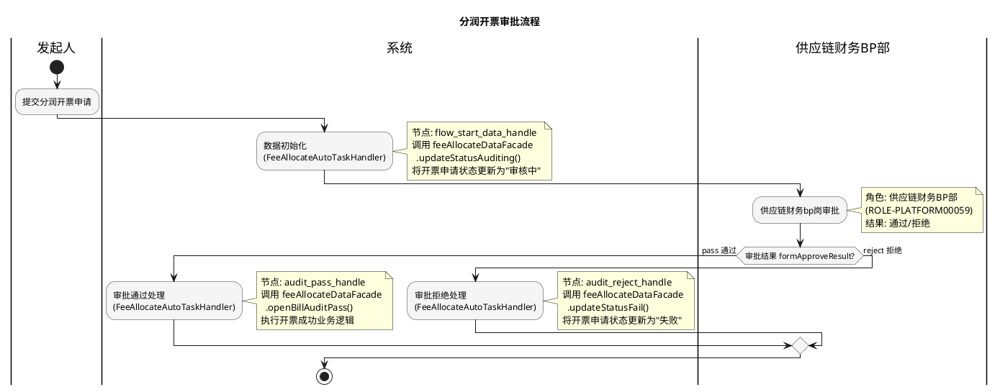

# 分润开票审批流程业务文档

## 1. 业务概述

### 1.1 定义
分润开票审批流程是供应链金融平台中用于管理平台服务费分润开票的审批流程。当平台需要向合作方开具分润发票时，通过供应链财务BP岗审批，确保开票金额、开票方/收票方信息的准确性和合规性。

### 1.2 目标
- 规范平台服务费分润开票操作
- 通过单级审批机制保障开票准确性
- 自动化处理审批通过后的开票业务和审批拒绝后的状态回退

### 1.3 价值
- 简化分润开票审批流程（6个节点，最简单的审批流程）
- 减少人工操作环节，降低出错概率
- 自动化状态流转，提升业务处理效率

## 2. 业务流程

### 2.1 业务流程图

### 2.2 详细流程说明

#### 阶段一：流程启动与数据初始化
- 发起人提交分润开票申请，以开票流水编号（openBillSeqNo）作为 businessId
- `FeeAllocateAutoTaskHandler` 在 `flow_start_data_handle` 节点触发
- 调用 `feeAllocateDataFacade.updateStatusAuditing(openBillSeqNo)` 将开票申请状态更新为"审核中"

#### 阶段二：供应链财务BP岗审批
- 审批角色：**供应链财务BP部**（ROLE-PLATFORM00059）
- 审批结果：通过（pass）/ 拒绝（reject）
- 该流程不支持退回操作

#### 阶段三：审批结果处理
- **通过**：`FeeAllocateAutoTaskHandler` 在 `audit_pass_handle` 节点触发
  - 调用 `feeAllocateDataFacade.openBillAuditPass(openBillSeqNo)` 执行开票成功逻辑
- **拒绝**：`FeeAllocateAutoTaskHandler` 在 `audit_reject_handle` 节点触发
  - 调用 `feeAllocateDataFacade.updateStatusFail(openBillSeqNo)` 更新状态为失败

## 3. 业务规则

### 3.1 约束条件
| 规则编号 | 规则描述 | 说明 |
|---------|---------|------|
| R001 | openBillSeqNo 必填 | 流程启动时 businessId 即为开票流水编号 |
| R002 | 单级审批制 | 仅需供应链财务BP岗审批一级 |
| R003 | 不支持退回 | 审批结果仅通过或拒绝 |

### 3.2 审批规则
| 规则编号 | 规则描述 | 说明 |
|---------|---------|------|
| R101 | 审批通过即开票 | 通过后自动执行开票业务 |
| R102 | 审批拒绝即终止 | 拒绝后开票申请状态置为失败 |

## 4. 监听器说明

### 4.1 全局监听器

| 监听器 | 类型 | 说明 |
|--------|------|------|
| FeeAllocateGlobalTaskNoticeHandler | 全局任务通知扩展 | 平台服务费分润审核流程全局监听处理 |

### 4.2 节点监听器

| 监听器 | 类型 | 绑定节点 | 说明 |
|--------|------|---------|------|
| FeeAllocateAutoTaskHandler | 节点执行监听器 | flow_start_data_handle、audit_pass_handle、audit_reject_handle | 根据节点ID分派不同处理逻辑 |

### 4.3 监听器详细说明

#### FeeAllocateGlobalTaskNoticeHandler（全局通知）
- **触发时机**：任务创建/完成时
- **核心逻辑**：全局任务通知，向相关人员发送审批任务创建/完成通知

#### FeeAllocateAutoTaskHandler（自动节点处理）
- **触发时机**：各自动节点END事件
- **输入**：`form.getBusinessId()` 即 openBillSeqNo
- **核心逻辑**：基于 `form.getElementKey()` 分支处理
  - `flow_start_data_handle`：调用 `feeAllocateDataFacade.updateStatusAuditing(openBillSeqNo)` — 更新为审核中
  - `audit_pass_handle`：调用 `feeAllocateDataFacade.openBillAuditPass(openBillSeqNo)` — 开票审批通过
  - `audit_reject_handle`：调用 `feeAllocateDataFacade.updateStatusFail(openBillSeqNo)` — 更新为失败
- **依赖服务**：`FeeAllocateDataFacade`（费用分润数据门面）

## 5. 状态管理

### 5.1 业务状态流转

| 当前状态 | 触发事件 | 目标状态 | 说明 |
|---------|---------|---------|------|
| 待提交 | 流程启动 | 审核中 | updateStatusAuditing |
| 审核中 | 审批通过 | 已通过/已开票 | openBillAuditPass |
| 审核中 | 审批拒绝 | 失败 | updateStatusFail |

### 5.2 状态转换规则
- 流程启动即将状态更新为"审核中"
- 审批通过后由 `FeeAllocateDataFacade.openBillAuditPass` 处理开票成功逻辑
- 审批拒绝后状态置为"失败"

### 5.3 异常处理
- 自动节点处理异常会导致流程中断
- 具体的异常处理逻辑封装在 `FeeAllocateDataFacade` 中

## 6. 消息通知

| 场景 | 触发时机 | 通知方式 | 说明 |
|------|---------|---------|------|
| 全局任务通知 | 任务创建/完成 | 站内信 | FeeAllocateGlobalTaskNoticeHandler处理 |

具体通知模板和接收人由 `FeeAllocateGlobalTaskNoticeHandler` 实现。

## 7. 配置项

| 配置项 | 说明 | 来源 |
|--------|------|------|
| 流程Key | Flow-a1a7121bb3244a1a852b0fec7552ab27 | FeeAllocateWorkFlowConstant.FEE_ALLOCATE_MAIN_FLOW |
| 流程类型 | 分润开票流程 | 流程定义 |

### 业务扩展字段

| 字段名 | 存储位置 | 说明 |
|--------|---------|------|
| ext1 | EXT1 | 开票流水编号 |
| ext2 | EXT2 | 开票方 |
| ext3 | EXT3 | 收票方 |
| ext4 | EXT4 | 开票金额 |
| ext5 | EXT5 | 关联交易笔数 |
| ext6 | EXT6 | 创建时间 |

### 流程节点ID

| 节点ID | 节点名称 | 类型 |
|--------|---------|------|
| Start-1731485694923 | 开始 | Start |
| AutoTask-flow_start_data_handle | 数据初始化 | AutoTask |
| RushSignTask-fin_bp_audit | 供应链财务bp岗审批 | RushSignTask |
| Exclusive-1731486020484 | 分支 | Exclusive |
| AutoTask-audit_pass_handle | 审批通过处理 | AutoTask |
| AutoTask-audit_reject_handle | 审批拒绝处理 | AutoTask |
| End-1731485695003 | 结束 | End |

## 8. 注意事项

1. **最简流程**：该流程仅6个节点，是所有审批流程中最简单的，单级审批即可完成
2. **无退回机制**：与其他流程不同，该流程不支持退回操作，审批结果为最终结果
3. **统一处理器**：所有自动节点由同一个 `FeeAllocateAutoTaskHandler` 处理，通过 elementKey 区分
4. **业务ID即流水号**：`businessId` 直接使用开票流水编号（openBillSeqNo），无需额外映射
5. **无全局变量**：该流程未定义自定义全局变量，仅使用系统默认变量
6. **相关服务**：核心业务逻辑封装在 jinkoscf-transaction 模块的 FeeAllocate、PlatFeeOpenBill 相关服务中
