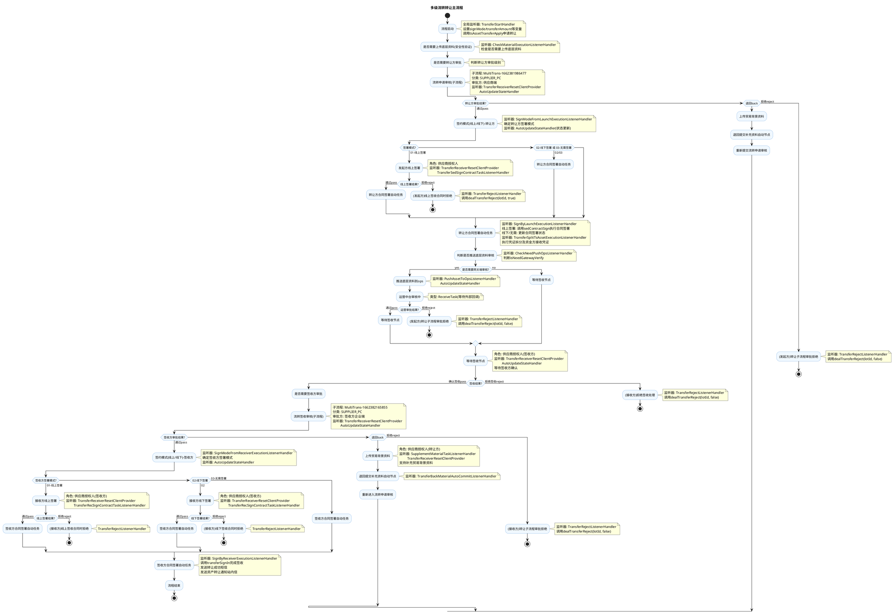

# 多级流转转让主流程业务文档

## 1. 业务概述

多级流转转让主流程是 jinkoscf 供应链金融平台的核心业务流程之一，用于处理凭证（数字资产）在供应商之间的多级流转转让。流程涵盖从转让申请发起、底层资料上传、转让方审批、合同签署（线上/线下/无需签署）、运营中台审核、等待签收、签收方审批、签收方合同签署、凭证拆分等完整的转让交易链路。

**流程Key**: `Flow-3072c98e8486455aa2a391a4d6cdd299`  
**流程版本**: V2  
**节点数量**: 40个（含起止节点、自动任务节点、抢签任务节点、排他网关、子流程节点、接收任务节点）  
**复杂度**: 高

**核心业务场景**：
- 供应商之间的凭证流转转让
- 支持线上签署、线下签署、无需签署三种合同签署模式
- 转让方和签收方双端审批
- 运营中台底层资料审核（可选）
- 凭证拆分及资金方接收

## 2. 业务流程

### 2.1 业务流程图（PlantUML）

### 2.2 详细流程说明

#### 2.2.1 流程启动与底层资料检查阶段

| 步骤 | 节点ID | 节点名称 | 节点类型 | 说明 |
|------|--------|---------|----------|------|
| 1 | Start-1661935978893 | 开始 | Start | 流程启动入口 |
| 2 | AutoTask-check_material | 是否需要上传底层资料(安全性) | AutoTask | 安全性验证，判断是否需要上传底层资料 |
| 3 | AutoTask-is_need_verify_from_lauch | 是否需要转让方审批 | AutoTask | 判断转让方审批级别 |

#### 2.2.2 转让方审批阶段

| 步骤 | 节点ID | 节点名称 | 节点类型 | 说明 |
|------|--------|---------|----------|------|
| 4 | MultiTrans-1662381986477 | 流转申请审核 | MultiTrans | 转让方企业审批子流程（SUPPLIER_PC端） |
| 5 | Exclusive-1662002959156 | 审核结果 | Exclusive | 按审批结果分支：pass/reject/back |
| 6 | RushSignTask-supplement_material | 上传贸易背景资料 | RushSignTask | 退回时由供应商授权人补充资料 |
| 7 | AutoTask-back_material_auto_commit | 退回提交补充资料自动节点 | AutoTask | 补充资料后重新进入审核 |

#### 2.2.3 转让方合同签署阶段

| 步骤 | 节点ID | 节点名称 | 节点类型 | 说明 |
|------|--------|---------|----------|------|
| 8 | AutoTask-sign_mode_from_launch | 签约模式(线上/线下)-转让方 | AutoTask | 确定转让方签署模式 |
| 9 | Exclusive-1663053128971 | 线上签署/线下签署 | Exclusive | 按signMode分支 |
| 10 | RushSignTask-launch_online_sign | 发起方线上签署 | RushSignTask | 供应商授权人线上签署合同 |
| 11 | AutoTask-sign_by_launch | 转让方合同签署自动任务 | AutoTask | 执行合同签署、凭证拆分等 |

#### 2.2.4 运营中台审核阶段（可选）

| 步骤 | 节点ID | 节点名称 | 节点类型 | 说明 |
|------|--------|---------|----------|------|
| 12 | AutoTask-needAssetMaterialCheck | 判断是否推送底层资料审核 | AutoTask | 按isNeedGatewayVerify判断 |
| 13 | AutoTask-pushAssetOps | 推送底层资料到ops | AutoTask | 推送资料到运营中台 |
| 14 | ReceiveTask-opsCheck | 运营中台审核中 | ReceiveTask | 等待运营中台回调 |
| 15 | Exclusive-1686217366775 | 运营审批结果 | Exclusive | 审核通过/拒绝 |

#### 2.2.5 签收阶段

| 步骤 | 节点ID | 节点名称 | 节点类型 | 说明 |
|------|--------|---------|----------|------|
| 16 | RushSignTask-wait_sign_in | 等待签收节点 | RushSignTask | 签收方确认签收/拒绝签收 |
| 17 | Exclusive-1665049349105 | 拒绝签收/确认签收 | Exclusive | 按签收结果分支 |
| 18 | AutoTask-is_need_verify_from_receiver | 是否需要签收方审批 | AutoTask | 判断签收方审批级别 |

#### 2.2.6 签收方审批与合同签署阶段

| 步骤 | 节点ID | 节点名称 | 节点类型 | 说明 |
|------|--------|---------|----------|------|
| 19 | MultiTrans-1662382165855 | 流转签收审核 | MultiTrans | 签收方企业审批子流程（SUPPLIER_PC端） |
| 20 | AutoTask-sign_mode_from_receiver | 签约模式(线上/线下)-签收方 | AutoTask | 确定签收方签署模式 |
| 21 | RushSignTask-receiver_online_sign | 接收方线上签署 | RushSignTask | 签收方线上签署合同 |
| 22 | RushSignTask-receiver_offline_sign | 接收方线下签署 | RushSignTask | 签收方线下签署合同 |
| 23 | AutoTask-sign_by_receiver | 签收方合同签署自动任务 | AutoTask | 完成签收、凭证拆分、发送通知 |

#### 2.2.7 拒绝处理节点

| 节点ID | 节点名称 | 触发场景 |
|--------|---------|---------|
| AutoTask-lauch_subprocess_reject | (发起方)转让子流程审批拒绝 | 转让方审批拒绝 / 运营审核拒绝 |
| AutoTask-lauch_online_sign_reject | (发起方)线上签收合同时拒绝 | 转让方线上签署时拒绝 |
| AutoTask-reciver_reject_sign_in | (接收方)拒绝签收处理 | 签收方拒绝签收 |
| AutoTask-receiver_subprocess_reject | (接收方)转让子流程审批拒绝 | 签收方审批子流程拒绝 |
| AutoTask-receiver_online_sign_reject | (接收方)线上签收合同时拒绝 | 签收方线上签署时拒绝 |
| AutoTask-receiver_offline_sign_reject | (接收方)线下签收合同时拒绝 | 签收方线下签署时拒绝 |

## 3. 业务规则

### 3.1 合同签署模式规则

| 签署模式(signMode) | 编码 | 说明 | 转让方行为 | 签收方行为 |
|--------------------|------|------|-----------|-----------|
| 线上签署 | 01 | 电子合同在线签署 | 需线上签署合同任务 | 需线上签署合同任务 |
| 线下签署 | 02 | 线下纸质合同签署 | 直接跳过签署节点 | 需线下签署确认任务 |
| 无需签署 | 03 | 无需签署合同 | 直接跳过签署节点 | 直接跳过签署节点 |

### 3.2 转让方合同签署规则

| 签署模式 | 处理逻辑 |
|---------|---------|
| 线上签署(01) | 调用sedContractSign执行电子合同签署 → 从交易影像树冗余合同到流水影像树 → 关闭合同签署状态 |
| 线下签署(02) | 直接执行转让方合同签署自动任务（不执行签署） |
| 无需签署(03) | 更新合同签署类型为TO_BE_SIGNED → 更新合同签署状态 |

### 3.3 拒绝处理规则

| 拒绝场景 | 处理方法 | dealTransferReject参数 |
|---------|---------|----------------------|
| 子流程审批拒绝(发起方/签收方/拒绝签收) | dealTransferReject(lotId, false) | needCancelContract=false |
| 合同签署时拒绝(发起方/签收方线上/线下) | dealTransferReject(lotId, true) | needCancelContract=true |

### 3.4 运营中台审核规则

| 条件 | 处理 |
|------|------|
| isNeedGatewayVerify == "yes" | 推送底层资料到运营中台 → 等待ReceiveTask回调 → 通过继续/拒绝终止 |
| isNeedGatewayVerify == "no"(默认) | 跳过运营审核，直接进入等待签收节点 |

### 3.5 退回补充资料规则

- 签收方审批子流程支持退回(back)操作
- 退回后流转到"上传贸易背景资料"节点（角色：供应商授权人-转让方）
- 补充完资料后由 `TransferBackMaterialAutoCommitListenerHandler` 自动提交
- 重新进入"流转申请审核"子流程

### 3.6 子流程审批规则

| 子流程 | 流程定义 | 审批方 | 审核节点 | 审批结果 |
|--------|---------|--------|---------|---------|
| 流转申请审核 | 转让-发起方审核子流程-V3 | 供应商授权人(转让方) | 发起方审核(RushSignTask-lauch_sub_1) | pass/reject/back |
| 流转签收审核 | 转让-签收审核子流程-V2 | 供应商授权人(签收方) | 一级审核(RushSignTask-1688033535818) | pass |

## 4. 接口说明/监听器说明

### 4.1 全局监听器

| 监听器 | 类型 | 类路径 | 功能说明 |
|--------|------|--------|---------|
| TransferStartHandler | 流程启动业务扩展 | `c.l.c.s.w.p.exthandler.listener.processbusinesshandler.transfer.TransferStartHandler` | 流程启动时解析业务参数、设置signMode/transferAmount等变量、调用tsAssetTransferApply发起转让申请 |
| TransferGlobalTaskNoticeHandler | 全局任务通知扩展 | `c.l.c.s.w.p.exthandler.listener.globaltasknoticehandler.transfer.TransferGlobalTaskNoticeHandler` | 处理全局任务通知事件，发送站内信、短信通知给转让方/签收方/核心企业 |
| TransferTerminalBussineessHandler | 流程终止业务扩展 | `c.l.c.s.w.p.exthandler.listener.terminalbusinesshandler.transfer.TransferTerminalBussineessHandler` | 流程被终止时处理拒绝逻辑，发送申请方拒绝通知和短信 |

### 4.2 节点监听器

| 监听器 | 类型 | 绑定节点 | 功能说明 |
|--------|------|---------|---------|
| CheckMaterialExecutionListenerHandler | 节点监听器 | AutoTask-check_material | 安全性验证，判断是否需要上传底层资料 |
| SupplementMaterialTaskListenerHandler | 任务监听器 | RushSignTask-supplement_material | 退回时处理补充贸易背景资料逻辑 |
| SignModeFromLaunchExecutionListenerHandler | 节点监听器 | AutoTask-sign_mode_from_launch | 确定转让方签约模式(线上/线下)，并更新状态 |
| SignModeFromReceiverExecutionListenerHandler | 节点监听器 | AutoTask-sign_mode_from_receiver | 确定签收方签约模式(线上/线下)，并更新状态 |
| SignByLaunchExecutionListenerHandler | 节点监听器 | AutoTask-sign_by_launch | 转让方合同签署自动任务：执行电子合同签署、影像树冗余、关闭签署状态 |
| TransferSplitTsAssetExecutionListenerHandler | 节点监听器 | AutoTask-sign_by_launch | 转让凭证拆分及资金方接收凭证，调用transferSplitTsAssetAndCreatePdf |
| SignByReceiverExecutionListenerHandler | 节点监听器 | AutoTask-sign_by_receiver | 签收方合同签署自动任务：调用transferSignIn完成签收、发送转让成功通知 |
| TransferRejectListenerHandler | 节点监听器 | 所有拒绝处理节点(7个) | 统一处理转让拒绝逻辑，根据节点区分是否需要撤销合同 |
| AutoUpdateStateHandler | 节点监听器 | 多个节点 | 状态更新处理器，在流程推进时更新交易状态 |
| TransferBackMaterialAutoCommitListenerHandler | 节点监听器 | AutoTask-back_material_auto_commit | 退回补充资料后自动提交 |
| CheckNeedPushOpsListenerHandler | 节点监听器 | AutoTask-needAssetMaterialCheck | 判断是否需要推送底层资料到运营中台 |
| PushAssetToOpsListenerHandler | 节点监听器 | AutoTask-pushAssetOps | 推送底层资料到运营中台(ops) |
| TransferReceiverResetClientProvider | 审批方切换 | 多个节点 | 签收方重置client，切换到签收方企业端 |
| TransferSedSignContractTaskListenerHandler | 任务监听器 | RushSignTask-launch_online_sign | 转出方签署合同任务监听 |
| TransferRecSignContractTaskListenerHandler | 任务监听器 | RushSignTask-receiver_online_sign, RushSignTask-receiver_offline_sign | 接受方签署合同任务监听 |

### 4.3 关键RPC接口

| 接口 | 方法 | 说明 |
|------|------|------|
| TsAssetFacade | tsAssetTransferApply(businessId) | 发起转让申请 |
| TsAssetFacade | transferSplitTsAssetAndCreatePdf(lotId, userId) | 凭证拆分及PDF生成 |
| ITransferTransactionProvider | dealTransferReject(lotId, needCancelContract) | 处理转让拒绝 |
| ITransferTransactionProvider | transferSignIn(lotId, userCode) | 执行签收操作 |
| ITransferSignProvider | sedContractSign(lotId) | 转出方电子合同签署 |
| ContractInfoProvider | updateApplyStatus(lotId, transactionIds, status) | 更新合同申请状态 |
| IDocMediaProvider | deleteFileByCatgId() | 删除影像文件 |
| MediaOperaProvider | copyMediaFile() | 冗余合同影像到流水影像树 |
| ProductBusinessProvider | - | 产品业务服务 |
| TsTransactionLotProvider | getById(lotId) | 获取交易流水信息 |
| TsTransactionProvider | loadTransactionInfoBylotId(lotId) | 获取交易明细列表 |
| NoticeInfoFacade | sendNotice() | 发送站内信通知 |
| MessageInfoFacade | sendSms() / sendBatchSms() | 发送短信通知 |

## 5. 状态管理

### 5.1 流程全局变量

| 变量名 | 标签 | 类型 | 默认值 | 说明 |
|--------|------|------|--------|------|
| launcher | 流程发起人 | STR | default | 发起人标识 |
| currUser | 当前用户 | STR | default | 当前操作用户 |
| formApproveResult | 审批结果 | STR | default | pass/reject/back |
| isNeedTransferVerify | 是否需要转出方审核 | STR | default | yes/no |
| isNeedGatewayVerify | 是否需要网关端审核 | STR | no | yes/no，默认no |
| isNeedReciverVerify | 是否需要签收方审批 | STR | default | yes/no |
| signMode | 签署模式 | STR | default | 01(线上)/02(线下)/03(无需) |
| specialId | 业务编号(流水号lotId) | STR | default | 转让流水号 |
| appNo | appNo | STR | default | 申请编号 |
| subClient | 客户id | STR | default | 审批方客户端ID |
| taskCustId | 通知企业编号 | STR | 999999999 | 任务通知企业ID |
| taskCustType | 通知企业类型 | STR | 06 | 任务通知企业类型 |
| distributeParamStr | 分布式事务处理参数 | STR | default | JSON格式的分布式事务参数 |
| sedCompanyId | 发起方企业id | STR | default | 转出方企业ID |
| recCompanyId | 接收方企业id | STR | default | 签收方企业ID |
| transferAmount | 转让金额 | STR | 0 | 本次转让金额 |
| launcherName | 申请人 | STR | 申请人 | 申请人名称 |

### 5.2 业务扩展元数据(bizExtMetadata)

| 存储位置 | 字段名 | 名称 | 说明 |
|----------|--------|------|------|
| ext1 | appNo | 转让申请编号 | 转让申请业务编号 |
| ext2 | recCompanyName | 接收人 | 签收方企业名称 |
| ext3 | transferAmount | 转让金额 | 转让金额 |
| ext4 | applyTime | 转让申请时间 | 申请时间 |
| ext5 | specialId | 业务编号(流水号lotId) | 流水号 |
| ext6 | sedCompanyName | 转出方 | 转出方企业名称 |
| ext7 | transferType | 类型(用于筛选转让) | 转让类型 |
| ext8 | ticketNum | 凭证数量 | 转让凭证数量 |
| ext9 | recCompanyId | 接收方企业id | 签收方企业ID |
| ext10 | sedCompanyId | 转出方企业id | 转出方企业ID |
| ext11 | launcherName | 申请人 | 申请人名称 |
| ext30 | noticeCustName | 站内信通知的客户名称 | 流程推进中动态切换通知对象 |

### 5.3 交易状态流转

| 阶段 | 状态说明 |
|------|---------|
| 流程启动 | 调用tsAssetTransferApply发起转让 |
| 转让方审批通过 | AutoUpdateStateHandler更新状态 |
| 合同签署完成 | 更新合同签署状态 |
| 运营审核通过 | 进入等待签收 |
| 签收完成 | 调用transferSignIn完成签收 |
| 拒绝/终止 | 调用dealTransferReject回退状态 |

## 6. 消息通知

### 6.1 站内信通知场景

| 场景编码 | 触发条件 | 通知对象 | 说明 |
|----------|---------|---------|------|
| ASSET_TRANSFER_NOTICE | 签收方合同签署完成 | 核心企业客户管理员/资产创建人 | 资产转让通知 |
| TRANSFER_LAUCH_CONTRACT_SIGN_SCENE | 发起方合同签署 | 转让相关方 | 转让方签署合同通知 |
| TRANSFER_NOTICE_SED_CONTRACT_REJECT | 流程被终止 | 转出方发起人 | 申请方拒绝签署合同通知 |

### 6.2 短信通知场景

| 模板编号 | 触发条件 | 通知对象 | 说明 |
|---------|---------|---------|------|
| TRANSFER_SUCC_SMS_TEMPLATENO | 转让签收成功 | 转出方授权人 | 转让成功短信提醒 |
| APPLYER_REJECT_SIGN_CONTRACT_TEMPLATENO | 流程被终止 | 转出方发起人 | 拒绝签署合同短信 |

### 6.3 通知方式及时机

| 流程阶段 | 站内信 | 短信 | 通知对象动态切换 |
|---------|--------|------|----------------|
| 待签收 | 是 | - | ext30切换为签收方(recCompanyName) |
| 签收成功 | 是 | 是 | 核心企业+转出方 |
| 拒绝/终止 | 是 | 是 | 转出方发起人 |

## 7. 配置项

| 配置项 | 来源 | 说明 |
|--------|------|------|
| isNeedGatewayVerify | 流程变量(默认no) | 是否需要网关端审核(运营中台审核) |
| signMode | 启动参数(前端传入) | 合同签署模式：01线上/02线下/03无需 |
| PlatformConfig.platformName | 配置 | 平台名称(用于短信模板) |
| TransferWorkFlowConstant.TRANSFER_MAIN_FLOW | 常量 | 转让主流程Key |
| TransferMediaConstant.modelCode | 常量 | 影像模型编码 |
| TransferMediaConstant.transfer_contract_code | 常量 | 转让合同影像分类编码 |

## 8. 注意事项

1. **双端审批**: 转让流程涉及转让方和签收方两个端的审批和签署，通过 `TransferReceiverResetClientProvider` 实现审批方的动态切换。
2. **合同签署模式**: signMode 在流程启动时由前端传入，贯穿整个流程，转让方和签收方可能使用不同的签署模式。
3. **凭证拆分时机**: 凭证拆分（`TransferSplitTsAssetExecutionListenerHandler`）在转让方合同签署自动任务节点（AutoTask-sign_by_launch）的END事件触发，与合同签署监听器绑定同一节点。
4. **运营中台审核**: 通过 `ReceiveTask` 等待外部回调，运营中台审核是可选环节，由 `isNeedGatewayVerify` 变量控制。
5. **分布式事务处理**: 流程中使用 `distributeParamStr` 变量传递分布式事务参数，`SignByLaunchExecutionListenerHandler` 中有容错处理机制，当RPC获取数据失败时从该参数中恢复。
6. **流程终止处理**: 流程被终止（terminate操作）时由 `TransferTerminalBussineessHandler` 处理，会调用 `dealTransferReject` 回退业务状态并发送通知。
7. **多个结束节点**: 流程有多个结束节点（End），分别对应不同的拒绝场景，每个拒绝路径都有专门的拒绝处理自动任务节点。
8. **退回机制**: 签收方审批子流程支持退回到"上传贸易背景资料"节点，由转让方补充资料后重新提交审核，形成审批-退回-补充-重审的闭环。
9. **通知对象动态切换**: 流程推进中通过更新 `ext30`(noticeCustName) 实现站内信通知对象的动态切换，确保在不同阶段通知到正确的企业方。
10. **影像树冗余**: 线上签署完成后，会将交易级别的合同影像冗余到流水级别的影像树上，确保数据一致性。
