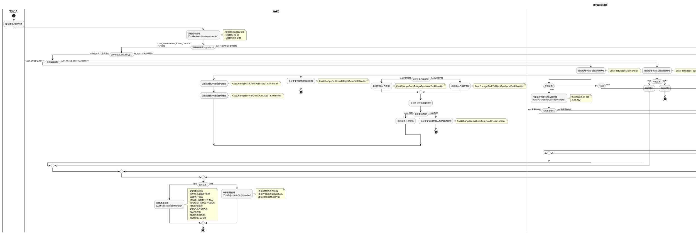

# 建档审核业务文档

## 1. 业务概述

### 1.1 定义
建档审核流程是供应链金融平台中用于管理企业客户建档（开户）、企业信息变更的核心审批流程。支持三种业务类型：企业建档（CUST_BUILD）、企业激活变更（CUST_ACTIVE_CHANGE）和企业变更（CUST_CHANGE）。流程涉及内管开户和客户端开户两种开户方式，以及业务经理审批和采购人员审批等多级审批环节。

### 1.2 目标
- 规范企业客户建档、变更的审批管理
- 根据不同申请类型和开户方式灵活路由审批流程
- 审批通过后自动完成客户信息同步、账户激活、产品开通等操作
- 支持退回补充资料机制，提升审批灵活性

### 1.3 价值
- 统一管理三种企业申请类型，覆盖完整的客户生命周期
- 内管/客户端双通道开户，满足不同场景需求
- 自动化处理建档通过后的一系列后续操作（同步数据、开通产品、发短信等）
- 采购人员审批环节保障供应商准入的合规性

## 2. 业务流程

### 2.1 业务流程图

### 2.2 详细流程说明

#### 阶段一：流程启动
- `CustProccessBusinessHandler` 处理流程启动
- 解析 businessData 获取 specialId 等关键参数
- 将所有变量（applyType、custBuildType、custName、managerName等）写入流程变量
- businessId 作为 appNo 使用

#### 阶段二：类型路由
根据 `applyType` 进行第一级路由：
- **CUST_BUILD / CUST_ACTIVE_CHANGE**：进入开户审批分支
- **CUST_CHANGE**：进入变更审核分支

#### 阶段三：开户审批（CUST_BUILD / CUST_ACTIVE_CHANGE）
根据 `custBuildType` 进行第二级路由：

**AGW_BUILD（内管开户）**：
- 再根据 applyType 区分正常开户和变更开户
- CUST_BUILD：业务经理审批 → 通过时判断采购审批 → 采购审批（可选）→ 通过/拒绝
- CUST_ACTIVE_CHANGE：业务经理审批 → 通过/拒绝（无采购审批，无退回）

**PC_BUILD（客户端开户）**：
- 业务经理审批 → 通过时判断采购审批 → 采购审批（可选）→ 通过/拒绝
- 支持退回补充资料（退给客户端用户）

#### 阶段四：变更审核（CUST_CHANGE）
- 业务经理审批 → 通过时执行变更通过自动任务
- 拒绝时执行变更拒绝自动任务
- 退回时根据 clientType 区分退回内管端还是客户端
  - 发起人修改后可重新提交（同意）或放弃（拒绝）

#### 阶段五：采购人员审批
- `CustPurchasingAutoTaskHandler` 判断是否需要采购审批
- 条件：企业类型包含供应商（SUPPLIER）且为首次供应商标识（firstSupFlag=yes）
- 需要时设置 `custPurchasingFlag=YES`，路由到采购人员审批节点
- 采购审批人由 `CustPurchasingStaffHandler` 动态确定

#### 阶段六：最终处理
**审核通过（CustPassAutoTaskHandler）**：
1. 更新建档状态为 CUST_BUILD_SUCCESS
2. 同步申请信息到客户管理
3. 根据开户方式设置客户状态：
   - AGW_BUILD：BUILD_ACTIVATE + ADD
   - PC_BUILD + 注册CA：BUILD_SUCCESS + EFFECT
   - PC_BUILD + 无CA：BUILD_SUCCESS + EFFECT
4. 供应商：初始化行方准入（交通银行、民生银行渠道）
5. 核心企业：同步招行白名单
6. 拷贝影像文件到客户信息目录
7. 更新产品开通状态（根据签约模式区分）
8. 加入管理员角色
9. 推送企业建档信息到运营系统
10. 发送短信通知：
    - AGW开户：根据用户是否已存在发送不同模板
    - PC开户：发送线下审批通过短信
11. 发送站内信给业务经理

**审核拒绝（CustRejectAutoTaskHandler）**：
1. 更新建档状态为 CUST_BUILD_FAIL
2. 更新客户状态为 BUILD_FAIL
3. 更新产品开通状态为 FAIL
4. 发送拒绝短信给企业授权人手机
5. 发送拒绝邮件给企业授权人邮箱
6. 发送站内信给业务经理

## 3. 业务规则

### 3.1 约束条件
| 规则编号 | 规则描述 | 说明 |
|---------|---------|------|
| R001 | specialId 必填 | 启动流程时businessData中必须包含specialId |
| R002 | businessData 必填 | 启动流程时必须提供业务数据 |

### 3.2 路由规则
| 规则编号 | 变量 | 值 | 路由目标 |
|---------|------|-----|---------|
| R101 | applyType | CUST_BUILD / CUST_ACTIVE_CHANGE | 开户审批分支 |
| R102 | applyType | CUST_CHANGE | 变更审核分支 |
| R103 | custBuildType | AGW_BUILD | 内管开户 |
| R104 | custBuildType | PC_BUILD | 客户端开户 |
| R105 | custPurchasingFlag | YES | 需要采购人员审批 |
| R106 | custPurchasingFlag | NO | 无需采购人员审批 |
| R107 | clientType | AGW | 退回内管端发起人 |
| R108 | clientType | 非AGW | 退回客户端发起人 |

### 3.3 采购审批触发条件
- 企业类型包含 SUPPLIER（供应商）
- firstSupFlag = yes（首次供应商标识）
- 两个条件同时满足时 custPurchasingFlag = YES

### 3.4 客户状态规则
| 开户方式 | 是否注册CA | 建档状态 | 客户状态 |
|---------|-----------|---------|---------|
| AGW_BUILD | - | BUILD_ACTIVATE | ADD |
| PC_BUILD | 是 | BUILD_SUCCESS | EFFECT |
| PC_BUILD | 否 | BUILD_SUCCESS | EFFECT |
| 其他 | - | BUILD_ACTIVATE | ADD |

### 3.5 产品开通状态规则
| 建档状态 | 签约模式 | 产品开通状态 |
|---------|---------|------------|
| BUILD_SUCCESS | 线上签约 | PROD_SIGNING |
| BUILD_SUCCESS | 非线上签约 | PASS |
| BUILD_ACTIVATE | - | SIGNING |
| BUILD_FAIL | - | FAIL |

## 4. 监听器说明

### 4.1 全局监听器

| 监听器 | 类型 | 说明 |
|--------|------|------|
| CustProccessBusinessHandler | 流程启动业务扩展 | 多级流转建档流程启动，校验参数，初始化变量 |
| CustGlobalTaskNoticeHandler | 全局任务通知扩展 | 全局任务通知事件监听 |

### 4.2 节点监听器

| 监听器 | 类型 | 绑定节点 | 说明 |
|--------|------|---------|------|
| CustFirstCheckTaskHandler | 任务监听器 | 多个业务经理审批节点 | 初审岗位审核相关处理 |
| CustAuthBackTaskHandler | 任务监听器 | 补充资料节点 | 客户端退回补充资料相关处理 |
| CustAuditSpyApproveClientProvider | 切换审批方 | 补充资料节点 | 多级流转建档退回补充资料-供应商端 |
| CustPurchasingAutoTaskHandler | 节点执行监听器 | 采购判断自动节点 | 判断是否需要采购人员审批 |
| CustPurchasingStaffHandler | 自定义审批方 | 采购人员审批节点 | 动态确定采购审批人 |
| CustRejectAutoTaskHandler | 节点执行监听器 | 审核拒绝节点 | 审核拒绝后的状态更新和通知 |
| CustPassAutoTaskHandler | 节点执行监听器 | 审核通过节点 | 审核通过后的全部后续处理 |

### 4.3 变更相关监听器

| 监听器 | 类型 | 说明 |
|--------|------|------|
| CustChangeFirstCheckTaskHandler | 节点执行监听器 | 企业变更初审节点处理 |
| CustChangeFirstCheckPassAutoTaskHandler | 节点执行监听器 | 企业变更初审通过自动任务 |
| CustChangeSecondCheckPassAutoTaskHandler | 节点执行监听器 | 企业变更复审通过自动任务 |
| CustChangeFirstCheckRejectAutoTaskHandler | 节点执行监听器 | 企业变更初审拒绝自动任务 |
| CustChangeBackToAgwApplicantTaskHandler | 任务监听器 | 退回内管端发起人修改信息 |
| CustChangeBackToClientApplicantTaskHandler | 任务监听器 | 退回客户端发起人修改信息 |
| CustChangeBackCheckRejectAutoTaskHandler | 节点执行监听器 | 企业变更退回发起人拒绝后的自动任务 |

### 4.4 关键监听器详细说明

#### CustProccessBusinessHandler（流程启动）
- **触发时机**：流程启动
- **核心逻辑**：
  1. 解析 businessData 获取 specialId 等参数
  2. 将所有变量写入流程变量
  3. 设置 businessId 为 appNo

#### CustPurchasingAutoTaskHandler（采购判断）
- **触发时机**：自动节点START事件
- **核心逻辑**：
  1. 查询建档申请信息
  2. 判断企业类型包含 SUPPLIER 且 firstSupFlag = yes
  3. 满足条件设置 `custPurchasingFlag=YES`，否则为 `NO`

#### CustPassAutoTaskHandler（审核通过）
- **触发时机**：审核通过节点START事件
- **核心逻辑**：
  1. 更新建档状态为 CUST_BUILD_SUCCESS
  2. 调用 `syncToCompanyInfo` 同步客户信息
  3. 根据开户方式和CA注册情况设置客户状态
  4. 供应商初始化行方准入（交通银行bocom、民生银行cmbc）
  5. 核心企业同步招行白名单
  6. 拷贝影像文件、更新产品开通状态
  7. 加入管理员、推送运营系统
  8. 发送短信/站内信通知

#### CustRejectAutoTaskHandler（审核拒绝）
- **触发时机**：审核拒绝节点START事件
- **核心逻辑**：
  1. 更新建档状态为 CUST_BUILD_FAIL
  2. 更新客户状态为 BUILD_FAIL
  3. 记录拒绝原因到扩展数据
  4. 更新产品开通状态为 FAIL
  5. 发送拒绝短信、邮件、站内信

## 5. 状态管理

### 5.1 业务状态流转

| 当前状态 | 触发事件 | 目标状态 | 说明 |
|---------|---------|---------|------|
| 待审批 | 流程启动 | 审批中 | 提交建档申请 |
| 审批中 | 审核通过(AGW) | BUILD_ACTIVATE | 内管开户需激活 |
| 审批中 | 审核通过(PC+无CA) | BUILD_SUCCESS | 客户端开户直接成功 |
| 审批中 | 审核通过(PC+有CA) | BUILD_SUCCESS | 客户端开户直接成功 |
| 审批中 | 审核拒绝 | BUILD_FAIL | 建档失败 |
| 审批中 | 退回补充资料 | 审批中（待补充） | 等待补充资料后重新审批 |

### 5.2 客户状态对应关系
| 建档状态 | 客户状态 | 说明 |
|---------|---------|------|
| BUILD_ACTIVATE | ADD（新增） | 等待企业激活 |
| BUILD_SUCCESS | EFFECT（生效） | 企业已建档成功 |
| BUILD_FAIL | BUILD_FAIL | 建档失败 |

### 5.3 异常处理
- 行方准入初始化异常不阻塞流程，仅记录日志
- 招行白名单同步异常不阻塞流程，仅记录日志
- 短信/邮件发送失败不阻塞流程，仅记录日志
- 影像文件拷贝失败不阻塞流程，仅记录日志

## 6. 消息通知

### 6.1 站内信

| 场景编码 | 触发时机 | 通知对象 | 说明 |
|---------|---------|---------|------|
| CUST_BUILD_02 | 审核通过 | 业务经理 | 企业认证审批通过通知 |
| CUST_BUILD_03 | 审核拒绝 | 业务经理 | 企业认证审批拒绝通知 |

### 6.2 短信通知

| 场景 | 触发时机 | 接收人 | 模板说明 |
|------|---------|--------|---------|
| AGW开户通过-新用户 | 审核通过 | 企业授权人手机 | 邀请签约 |
| AGW开户通过-已存在用户 | 审核通过 | 企业授权人手机 | 邀请已存在授权人登录 |
| PC开户通过 | 审核通过 | 企业授权人手机 | 线下审批通过 |
| 审核拒绝 | 审核拒绝 | 企业授权人手机 | 拒绝通知+原因 |

### 6.3 邮件通知

| 场景 | 触发时机 | 接收人 | 说明 |
|------|---------|--------|------|
| 开户拒绝 | 审核拒绝 | 企业授权人邮箱 | 拒绝通知+原因 |

## 7. 配置项

| 配置项 | 说明 | 来源 |
|--------|------|------|
| 流程Key | Flow-ff8bba44eb9a47b39196be196a275d3b | CustWorkFlowConstant.CUST_MAIN_FLOW |
| 流程类型 | 多级流转-建档流程 | 流程定义 |
| PlatformConfig | 平台名称、热线电话、网站地址 | 配置 |
| WorkflowNacosConfig | 项目编码、应用编码、企业信息 | Nacos配置 |
| CustCommonNacosProperties | 平台名称、供应商网站 | Nacos配置 |

### 业务扩展字段

| 字段名 | 存储位置 | 说明 |
|--------|---------|------|
| applyTypeName | EXT1 | 申请类型 |
| custName | EXT2 | 客户名称 |
| appNo | EXT3 | 申请编号 |
| certificationWay | EXT4 | 开户方式 |
| managerName | EXT5 | 业务经理 |
| custId | EXT6 | 企业ID |
| noticeTitlePrefix | EXT30 | 站内信标题前缀 |

### 全局变量

| 变量名 | 标签 | 默认值 | 说明 |
|--------|------|-------|------|
| launcher | 流程发起人 | default | 记录流程发起人 |
| currUser | 当前用户 | default | 当前操作用户 |
| formApproveResult | 审批结果 | default | 审批结果 |
| applyType | 流程审核类型 | CUST_BUILD | CUST_BUILD/CUST_ACTIVE_CHANGE/CUST_CHANGE |
| custBuildType | 开户方式 | AGW_BUILD | AGW_BUILD/PC_BUILD |
| currUserName | 当前用户姓名 | default | 当前用户姓名 |
| custId | 企业id | 0 | 企业ID |
| clientType | 发起人客户端类型 | default | AGW/其他 |
| custPurchasingFlag | 采购审批标识 | NO | YES/NO |

### 审批角色

| 角色名称 | 角色Key | 使用节点 |
|---------|---------|---------|
| 业务经理 | Businessmanager | 多个业务经理审批节点 |
| 内管工作流管理员 | ROLE-PLATFORM00151 | 辅助审批角色 |
| 核心企业子公司授权人 | coreSubAuthUser | 补充资料节点 |
| 核心企业分公司授权人 | coreBranchAuthUser | 补充资料节点 |
| 核心企业职能部门授权人 | coreDepartmentAuthUser | 补充资料节点 |
| 资金方授权人 | finaceAuthUser | 补充资料节点 |
| 核心企业授权人 | coreAuthUser | 补充资料节点 |
| 供应商授权人 | supplierAuthUser | 补充资料节点 |
| 流程发起人 | default | 退回发起人节点 |
| 自定义审批方 | default | 采购人员审批节点 |

## 8. 注意事项

1. **流程复杂度最高**：27个节点，是所有流程中最复杂的，涉及多级路由和多种审批组合
2. **三种申请类型**：CUST_BUILD（建档）、CUST_ACTIVE_CHANGE（激活变更）、CUST_CHANGE（变更）走不同路径
3. **开户方式差异**：AGW_BUILD 和 PC_BUILD 在审批通过后的客户状态和后续处理不同
4. **采购审批条件**：仅供应商且首次供应商标识为yes时才触发采购人员审批
5. **行方准入**：供应商审核通过后自动初始化交通银行和民生银行渠道准入
6. **招行白名单**：核心企业审核通过后自动同步到招行白名单
7. **影像文件**：审核通过后需将申请阶段的影像文件拷贝到客户信息目录下
8. **退回机制**：
   - 开户审批：可退回补充资料（客户端/内管分别处理）
   - 变更审核：可退回发起人，根据clientType区分内管端和客户端
9. **通知多样性**：支持站内信、短信、邮件三种通知渠道
10. **CA注册**：客户端开户时是否注册CA会影响建档状态和后续流程
11. **产品开通**：支持FACTOR（保理）等产品服务，审批通过后自动开通
12. **变更流程独立性**：CUST_CHANGE 分支有独立的初审/复审/退回/拒绝自动任务处理器
