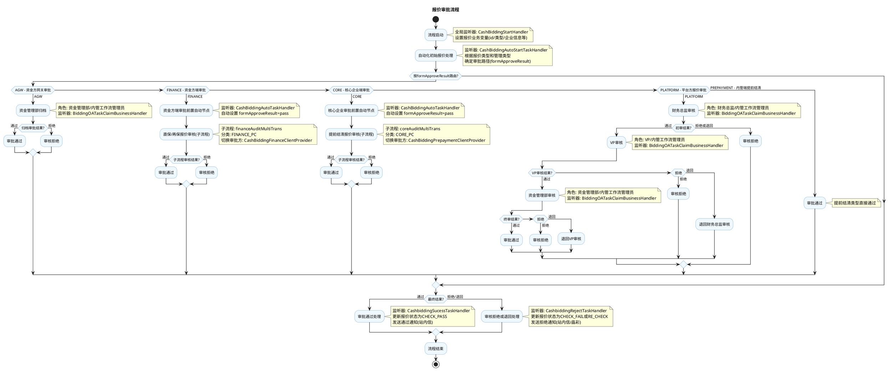

# 报价审批流程业务文档

## 1. 业务概述

报价审批流程是 jinkoscf 供应链金融平台的核心审批流程之一，用于对供应商/资金方提交的报价进行多级审批。流程根据报价类型（直保/再保融资、提前结清、平台方报价等）自动路由到不同的审批路径，支持单个审批和批量审批两种模式。

**流程Key**: `Flow-5c1ec020083e4be799f7ca80eb5d9b01`  
**流程版本**: V39  
**节点数量**: 21个（含起止节点、自动任务节点、抢签任务节点、排他网关、子流程节点）  
**复杂度**: 中等

**核心业务场景**：
- 直保/再保融资报价审核（资金方端审批）
- 提前结清报价审核（核心企业端审批）
- 平台方报价审核（内管三级审批）
- 资金方网关报价审核（AGW网关审批）
- 提前付款报价审核（直接通过）

## 2. 业务流程

### 2.1 业务流程图（PlantUML）

### 2.2 详细流程说明

#### 2.2.1 流程启动阶段

| 步骤 | 节点ID | 节点名称 | 节点类型 | 说明 |
|------|--------|---------|----------|------|
| 1 | Start-1663404762605 | 开始 | Start | 流程启动入口 |
| 2 | AutoTask-1675317990144 | 自动化初始报价的相关处理 | AutoTask | 根据报价类型确定审批路径 |
| 3 | Exclusive-1675318089995 | 互斥分支 | Exclusive | 按formApproveResult进行5条路径分发 |

#### 2.2.2 审批路径说明

**路径1: AGW（资金方网关审批）**
- 条件: `formApproveResult == "AGW"`
- 触发条件: 非平台方管理、客户端审批开关开启、非提前结清类型
- 流程: 资金管理部归档 → 通过/拒绝

**路径2: FINANCE（资金方端审批）**
- 条件: `formApproveResult == "FINANCE"`
- 触发条件: 非平台方管理、客户端审批开关关闭、非提前结清类型
- 流程: 前置自动节点 → 直保/再保报价审核子流程 → 通过/拒绝

**路径3: CORE（核心企业端审批）**
- 条件: `formApproveResult == "CORE"`
- 触发条件: 非平台方管理、客户端审批开关关闭、提前结清类型
- 流程: 前置自动节点 → 提前结清报价审核子流程 → 通过/拒绝

**路径4: PLATFORM（平台方三级审批）**
- 条件: `formApproveResult == "PLATFORM"`
- 触发条件: 平台方管理类型
- 流程: 财务总监审核 → VP审核 → 资金管理部审核 → 通过/拒绝
- 支持审批退回（VP可退回到财务总监、资金管理部可退回到VP）

**路径5: PREPAYMENT（提前付款直接通过）**
- 条件: `formApproveResult == "PREPAYMENT"`
- 触发条件: 客户端审批开关开启且提前结清类型
- 流程: 直接到审批通过节点

## 3. 业务规则

### 3.1 审批路径路由规则

| 条件 | 管理类型(tsBiddingManageType) | 客户端审批开关(financeApprovalFlag) | 报价类型(biddingType) | 路由结果 |
|------|------------------------------|------------------------------------|-----------------------|----------|
| 1 | PLATFORM | - | - | PLATFORM |
| 2 | 非PLATFORM | false | 非PREPAYMENT | FINANCE |
| 3 | 非PLATFORM | false | PREPAYMENT | CORE |
| 4 | 非PLATFORM | true | 非PREPAYMENT | AGW |
| 5 | 非PLATFORM | true | PREPAYMENT | PREPAYMENT |

### 3.2 审批结果处理规则

| 审批结果 | 状态变更 | 通知方式 |
|----------|---------|---------|
| pass(通过) | CHECK_PASS | 站内信通知发起人 |
| reject(拒绝) | CHECK_FAIL | 站内信通知发起人 |
| back(退回) | RE_CHECK | 站内信+晶彩通知发起人 |

### 3.3 通知对象确定规则

| 报价类型 | 通知对象企业 |
|----------|-------------|
| PREPAYMENT(提前结清) | 核心企业(coreCompany) |
| FINANCE(融资)+PLATFORM管理 | 核心企业(coreCompany) |
| 其他FINANCE(融资) | 资金方(financeCompany) |
| AGW(网关发起) | 内管发起人 |

### 3.4 平台方三级审批规则

- **初审**: 财务总监审核，支持 通过/拒绝/退回
- **复审**: VP审核，支持 通过/拒绝/退回（退回到财务总监）
- **终审**: 资金管理部审核，支持 通过/拒绝/退回（退回到VP）
- 初审拒绝或退回直接进入拒绝处理节点

### 3.5 批量审批规则

- 支持单个审批和批量审批两种模式
- 批量审批通过 `batchNo` 标识批次
- 批量审批时变量中存储 `biddingSize`(报价数量)
- 审批通过/拒绝时遍历批次内所有报价记录逐一处理

## 4. 接口说明/监听器说明

### 4.1 全局监听器

| 监听器 | 类型 | 类路径 | 功能说明 |
|--------|------|--------|---------|
| CashBiddingStartHandler | 流程启动业务扩展 | `c.l.c.s.w.p.exthandler.listener.processbusinesshandler.cashbidding.CashBiddingStartHandler` | 流程启动时获取报价信息，设置流程变量（报价ID、类型、企业信息等），支持单个/批量模式 |
| CashBiddingGlobalTaskNoticeHandler | 全局任务通知扩展 | `c.l.c.s.w.p.exthandler.listener.globaltasknoticehandler.cashbidding.CashBiddingGlobalTaskNoticeHandler` | 处理任务创建、完成、领取等全局事件，发送站内信和晶彩通知，支持自动委派 |

### 4.2 节点监听器

| 监听器 | 类型 | 绑定节点 | 功能说明 |
|--------|------|---------|---------|
| CashBiddingAutoStartTaskHandler | 节点监听器 | AutoTask-1675317990144(初始化) | 根据报价类型和管理类型确定审批路径(PLATFORM/FINANCE/CORE/AGW/PREPAYMENT) |
| CashbiddingRejectTaskHandler | 节点监听器 | AutoTask-1666360937483(拒绝) | 处理报价拒绝/退回，更新状态为CHECK_FAIL或RE_CHECK，发送拒绝通知和晶彩通知 |
| CashbiddingSucessTaskHandler | 节点监听器 | AutoTask-1666361080500(通过) | 处理报价通过，更新状态为CHECK_PASS，发送通过通知 |
| CashBiddingAutoTaskHandler | 节点监听器 | AutoTask-1687002016956, AutoTask-1687002055662(前置自动节点) | 资金方/核心企业端审批前置处理，自动设置formApproveResult=pass |
| BiddingOATaskClaimBusinessHandler | 任务领取业务扩展 | 平台方审批节点(财务总监/VP/资金管理部) | 处理OA任务领取事件，通知晶彩OA系统 |

### 4.3 子流程审批方切换

| 切换器 | 子流程 | 功能 |
|--------|-------|------|
| CashBiddingFinanceClientProvider | financeAuditMultiTrans(直保/再保报价审核) | 切换到资金方端(FINANCE_PC)进行审批 |
| CashBiddingPrepaymentClientProvider | coreAuditMultiTrans(提前结清报价审核) | 切换到核心企业端(CORE_PC)进行审批 |

### 4.4 关键RPC接口

| 接口 | 方法 | 说明 |
|------|------|------|
| CashBiddingFacade | updateStatusAfterApproval() | 审批后更新报价状态 |
| CashBiddingFacade | getConfigFlag() | 获取客户端审批开关配置 |
| NoticeInfoFacade | sendNotice() | 发送站内信通知 |
| JinkoClientProvider | sendTextWorkMessage() | 发送晶彩工作消息 |
| UserInfoFacade | getUserInfo() | 获取用户信息 |
| BiddingFetcher | fetchBidding() | 获取报价信息(支持单个/批量) |

## 5. 状态管理

### 5.1 报价审核状态(TsCashBiddingCheckStatus)

| 状态 | 枚举值 | 说明 | 触发条件 |
|------|--------|------|---------|
| 审核通过 | CHECK_PASS | 报价审核通过 | 所有审批路径最终通过 |
| 审核失败 | CHECK_FAIL | 报价审核拒绝 | 任意环节拒绝(reject) |
| 重新审核 | RE_CHECK | 报价被退回 | 平台方初审退回(back) |

### 5.2 流程全局变量

| 变量名 | 标签 | 类型 | 说明 |
|--------|------|------|------|
| launcher | 流程发起人 | STR | 发起人标识 |
| currUser | 当前用户 | STR | 当前操作用户 |
| formApproveResult | 审批结果 | STR | 路由变量：AGW/FINANCE/CORE/PLATFORM/PREPAYMENT/pass/reject/back |
| id | 报价id | STR | 单个审批时的报价ID |

### 5.3 业务扩展元数据(bizExtMetadata)

| 存储位置 | 字段名 | 名称 | 说明 |
|----------|--------|------|------|
| ext1 | id | 报价编号 | 报价记录ID |
| ext2 | biddingType | 报价类型 | FINANCE/PREPAYMENT等 |
| ext3 | financeCompany | (签收)资金方 | 资金方企业名称 |
| ext4 | coreCompany | 凭证开立方 | 核心企业名称 |
| ext5 | supplierCompany | 融资申请方/转出资金方/提前付款申请人 | 供应商企业名称 |
| ext6 | scfName | 特定化报价对象 | SCF名称 |
| ext7 | cashBiddingNo | 报价编号 | 报价业务编号 |
| ext8 | custId | 企业id | 关联企业ID |
| ext9 | companyType | 企业类型 | 企业分类 |
| ext10 | type | 管理类型 | PLATFORM等 |
| ext11 | financeCompanyId | 资金方企业id | 资金方ID |
| ext12 | coreCompanyId | 核心企业id | 核心企业ID |
| ext13 | batchNo | 流程编号 | 批量审批的批次号 |
| ext14 | biddingSize | 报价数量 | 批量审批的报价数量 |
| ext30 | companyName | 客户名称 | 用于展示的客户名称 |

## 6. 消息通知

### 6.1 站内信通知场景

| 场景编码 | 触发条件 | 通知对象 | 说明 |
|----------|---------|---------|------|
| CASHBIDDING_03 | 审批通过 + AGW发起 | 内管发起人 | 内管端通过通知 |
| CASHBIDDING_04 | 审批拒绝 + AGW发起 | 内管发起人 | 内管端拒绝通知 |
| CASHBIDDING_06 | 审批通过 + 提前结清 | 核心企业授权人 | 核心企业端通过通知 |
| CASHBIDDING_07 | 审批拒绝 + 提前结清 | 核心企业授权人 | 核心企业端拒绝通知 |
| CASHBIDDING_08 | 审批通过 + 融资类型 | 资金方授权人 | 资金方端通过通知 |
| CASHBIDDING_09 | 审批拒绝 + 融资类型 | 资金方授权人 | 资金方端拒绝通知 |

### 6.2 晶彩OA通知

| 触发条件 | 内容模板 | 说明 |
|---------|---------|------|
| 平台方审批退回(back) | `{平台名称}-{OA流程类型}({业务编号})-审批退回` | 通过JinkoClientProvider发送工作消息给流程发起人 |
| 任务领取 | 由JinkoOaClientFacade处理 | 平台方审批节点领取时同步OA |

## 7. 配置项

| 配置项 | 来源 | 说明 |
|--------|------|------|
| financeApprovalFlag | CashBiddingFacade.getConfigFlag() | 客户端审批开关，控制是走AGW网关还是客户端审批 |
| WorkflowNacosConfig.defaultCompanyName | Nacos配置 | 默认公司名称(用于内管端通知) |
| WorkflowNacosConfig.defaultCompanyType | Nacos配置 | 默认公司类型(用于内管端通知) |
| PlatformConfig.platformName | 配置 | 平台名称(用于晶彩通知消息) |

## 8. 注意事项

1. **审批路径自动路由**: 流程启动后由 `CashBiddingAutoStartTaskHandler` 自动根据报价类型和配置决定审批路径，无需人工干预路由。
2. **批量审批一致性**: 批量审批时，拒绝/通过操作会遍历批次内所有报价记录逐一处理，需注意批量操作的事务一致性。
3. **晶彩OA集成**: 平台方审批路径集成了晶彩OA系统，任务领取/退回时会同步通知OA。
4. **通知发送异常处理**: 通知发送失败不影响主流程，异常被 catch 后仅记录日志。
5. **子流程审批方切换**: FINANCE和CORE路径通过MultiTrans子流程实现多级流转，由ClientProvider负责切换审批方。
6. **前置自动节点**: FINANCE和CORE路径的前置自动节点会自动将 `formApproveResult` 设为 `pass`，确保子流程顺利启动。
7. **退回机制**: 仅PLATFORM路径的VP和资金管理部审核支持退回(back)操作，其他路径仅支持通过/拒绝。
