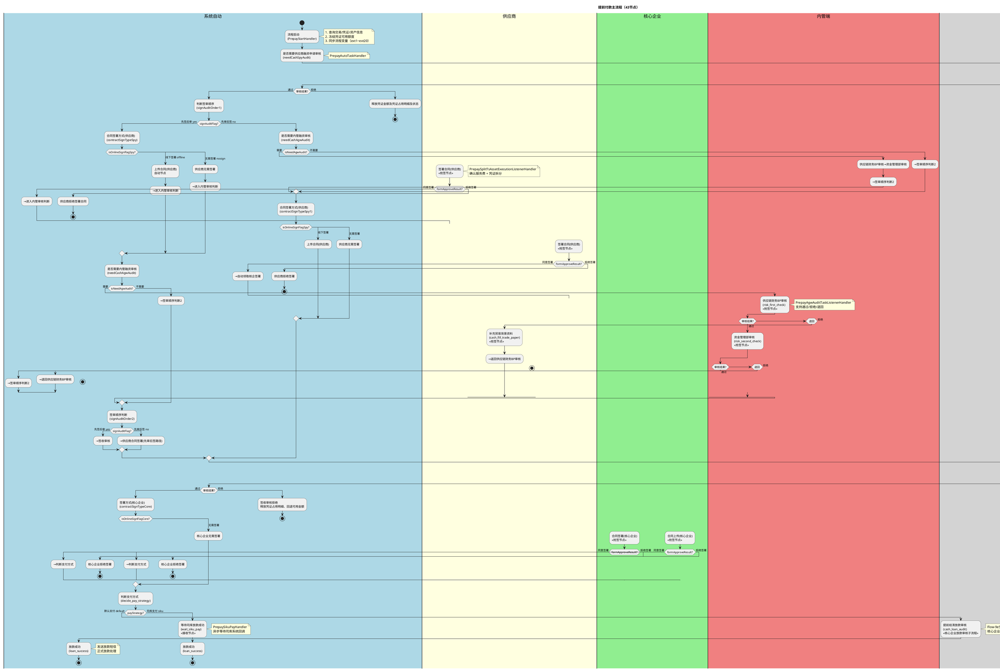

# 提前付款主流程业务文档

## 1. 业务概述

提前付款是供应链金融平台的重要交易流程，允许供应商将持有的数字债权凭证提前兑现。该流程涉及供应商（申请方）、核心企业（付款方）、内管端（风控审核），涵盖融资审核、合同签署、签收审核、放款审核和支付等关键环节。支持先签后审和先审后签两种签审顺序，以及默认支付和司库支付两种支付策略。

- **流程Key**: `Flow-54153e6d5aba45a382a14b536c76244e`
- **流程名称**: 提前付款主流程
- **节点数量**: 43个
- **复杂度**: 高
- **主要参与方**: 供应商（申请方）、核心企业（付款方）、内管端（风控/资金管理部）

## 2. 业务流程

### 2.1 业务流程图（PlantUML，含子流程平铺）



### 2.2 详细流程说明

#### 阶段一：流程启动
1. 供应商发起提前付款申请，触发 `PrepayStartHandler`
2. 系统查询交易信息、凭证信息、资产信息
3. 冻结凭证可用额度（`tsAssetTransApply`）
4. 同步流程变量到工作流引擎

#### 阶段二：融资申请审核
1. 系统判断是否需要供应商端融资申请审核（`needCashSpyAudit`）
2. 供应商审核子流程（MultiTrans-subSpyAudit）执行
3. 审核结果：通过→进入签审顺序判断；拒绝→释放凭证资源、流程结束

#### 阶段三：签审顺序与合同签署
1. 根据配置判断签审顺序（`signAuditFlag`）：先签后审 / 先审后签
2. **先签后审路径**：供应商先签署合同 → 内管审核 → 签收审核
3. **先审后签路径**：内管审核 → 供应商签署合同 → 签收审核
4. 供应商合同签署方式（`isOnlineSignFlagSpy`）：线上/线下/无需签署
5. 供应商线上签署时自动触发凭证拆分（`PrepaySplitTsAssetExecutionListenerHandler`）

#### 阶段四：内管融资审核
1. 判断是否需要内管审核（`isNeedAgwAudit`）
2. 审核链路：供应链财务BP审核 → 资金管理部审核
3. 支持退回供应商补充贸易背景资料
4. 资金管理部审核支持退回到供应链财务BP

#### 阶段五：签收审核与核企合同签署
1. 核心企业签收审核子流程（`Flow-9aa12fa10cfb47048a2cb2708a7f4c40`）
2. 签收通过后核心企业签署合同（`isOnlineSignFlagCore`）
3. 支持核心企业线上自动签署（`auto_claim_submit_core_sgin`）

#### 阶段六：放款审核与支付
1. 判断支付策略（`payStrategy`）：默认支付 / 司库支付
2. 默认支付路径：核心企业放款审核子流程 → 放款成功
3. 司库支付路径：等待司库系统回调 → 放款成功
4. 放款成功后发送短信通知、执行正式放款逻辑

## 3. 业务规则

### 3.1 凭证冻结规则
| 规则编号 | 规则描述 | 触发时机 |
|---------|---------|---------|
| R-PP-001 | 流程启动时冻结凭证可用额度 | PrepayStartHandler → tsAssetTransApply |
| R-PP-002 | 审核拒绝时恢复凭证可用额度 | SubFlowRejectAutoCleanTaskHandler → tsAssetTransFailed |
| R-PP-003 | 流程终止时释放发票占用 | PrepayTerminalBussineessHandler → realseInvoice |

### 3.2 签审顺序规则
| 规则编号 | 规则描述 | 条件 |
|---------|---------|------|
| R-PP-010 | 先签后审：供应商先签署合同再进行内管审核 | signAuditFlag = yes |
| R-PP-011 | 先审后签：内管审核通过后供应商再签署合同 | signAuditFlag = no |
| R-PP-012 | 签审顺序由产品配置项 MULTI_SIGN_AUDIT_FLAG 控制 | ProductBusinessProvider |

### 3.3 合同签署规则
| 规则编号 | 规则描述 | 条件 |
|---------|---------|------|
| R-PP-020 | 供应商合同签署方式：线上/线下/无需签署 | isOnlineSignFlagSpy = online/offline/nosign |
| R-PP-021 | 核心企业合同签署方式：线上/线下/无需签署 | isOnlineSignFlagCore = online/offline/nosign |
| R-PP-022 | 供应商线上签署时自动触发凭证拆分和服务费确认 | PrepaySplitTsAssetExecutionListenerHandler |
| R-PP-023 | 核心企业支持线上自动签署（自动领取提交） | auto_claim_submit_core_sgin |
| R-PP-024 | 供应商/核心企业拒绝签署合同将触发流程终止 | PrepayRejectSignContractTaskHandler |

### 3.4 内管审核规则
| 规则编号 | 规则描述 | 条件 |
|---------|---------|------|
| R-PP-030 | 是否需要内管审核由产品配置控制 | isNeedAgwAudit = yes/no |
| R-PP-031 | 内管审核链路：供应链财务BP → 资金管理部 | risk_first_check → risk_second_check |
| R-PP-032 | 供应链财务BP审核支持退回供应商补充贸易背景资料 | formApproveResult = back |
| R-PP-033 | 资金管理部审核支持退回供应链财务BP | formApproveResult = back |

### 3.5 支付规则
| 规则编号 | 规则描述 | 条件 |
|---------|---------|------|
| R-PP-040 | 默认支付：通过放款审核子流程确认后放款 | payStrategy = default |
| R-PP-041 | 司库支付：推送司库系统，异步等待回调确认 | payStrategy = siku |
| R-PP-042 | 放款成功后发送放款短信通知 | PrepayAutoTaskHandler → sendLoanMessage |

## 4. 接口说明/监听器说明

### 4.1 全局监听器

| 监听器 | 类型 | 说明 |
|--------|------|------|
| `PrepayStartHandler` | 流程启动业务扩展 | 查询交易/凭证/资产信息，冻结凭证额度，同步流程变量 |
| `PrepayGlobalTaskNoticeHandler` | 全局任务通知扩展 | 全局任务通知：根据节点类型发送短信和站内信 |
| `PrepayTerminalBussineessHandler` | 流程终止业务扩展 | 恢复凭证额度、释放发票、更新交易状态、删除支付记录 |

### 4.2 节点监听器

| 监听器 | 绑定节点 | 说明 |
|--------|---------|------|
| `PrepayAutoTaskHandler` | 15个自动节点 | 自动节点逻辑分发：签审顺序/合同方式/支付策略/放款等 |
| `PrepayAgwAuditTaskListenerHandler` | 内管审核节点 | 内管端审核任务处理（财务BP/资金管理部） |
| `PrepaySpyAuditTaskListenerHandler` | 供应商审核节点 | 供应商端签署合同任务处理 |
| `PrepayCoreAuditTaskListenerHandler` | 核心企业审核节点 | 核心企业端签署合同/签收/放款审核 |
| `PrepaySplitTsAssetExecutionListenerHandler` | 6个供应商签署节点 | 确认服务费 + 凭证拆分（END事件处理） |
| `PrepayRejectSignContractTaskHandler` | 拒绝签署自动节点 | 处理供应商/核心企业拒绝签署合同 |
| `SubFlowRejectAutoCleanTaskHandler` | 审核拒绝自动节点 | 子流程拒绝释放资源（恢复凭证额度） |
| `PrepaySikuPayHandler` | wait_siku_pay | 司库支付等待节点处理 |
| `RiskFirstCheckHandler` | risk_first_check | 自定义审批方业务扩展 |

### 4.3 子流程

| 子流程名称 | 流程Key | 触发节点 | 审批方 |
|-----------|---------|---------|--------|
| 提前结清申请审核 | - | MultiTrans-subSpyAudit | 供应商端(SUPPLIER_PC) |
| 核心企业签收审核 | Flow-9aa12fa10cfb47048a2cb2708a7f4c40 | MultiTrans-cash_sign_audit | 核心企业端(CORE_PC) |
| 核心企业放款审核 | Flow-9e55785d412f4ee0bc14ec5118049a55 | MultiTrans-cash_loan_audit | 核心企业端(CORE_PC) |

## 5. 状态管理

### 5.1 业务状态流转

```
交易状态:
  APPLY(申请中) → AUDITING(审核中) → SIGNING(签署中)
    → SIGN_AUDIT(签收审核中) → LOAN_AUDIT(放款审核中)
    → PAYING(支付中) → SUCCESS(放款成功) / REJECT(拒绝)

凭证状态:
  冻结可用额度 → 凭证拆分（子凭证生成）→ 资金方接收凭证 → 放款完成

支付状态(ext18):
  WAIT_COMMIT(待提交) → COMMITTED(已提交) → SUCCESS(成功) / FAIL(失败)
```

### 5.2 状态转换规则

| 当前状态 | 触发事件 | 目标状态 | 触发节点 |
|---------|---------|---------|---------|
| - | 流程启动 | APPLY | PrepayStartHandler |
| APPLY | 供应商审核通过 | AUDITING | subSpyAudit |
| AUDITING | 内管审核通过 | SIGNING | risk_second_check |
| SIGNING | 供应商签署合同 | SIGN_AUDIT | PrepaySplitTsAssetExecutionListenerHandler |
| SIGN_AUDIT | 签收审核通过 | LOAN_AUDIT | cash_sign_audit |
| LOAN_AUDIT | 核企签署合同 | PAYING | contractSignTypeCore |
| PAYING | 放款审核通过 | SUCCESS | loan_success |
| 任意状态 | 拒绝/终止 | REJECT | PrepayTerminalBussineessHandler |

### 5.3 异常处理

| 异常场景 | 处理方式 | 触发监听器 |
|---------|---------|-----------|
| 供应商审核拒绝 | 释放凭证金额和占用明细 | SubFlowRejectAutoCleanTaskHandler |
| 签收审核拒绝 | 释放凭证占用、回退可用金额 | SubFlowRejectAutoCleanTaskHandler |
| 供应商拒绝签署 | 触发流程终止、释放资源 | PrepayRejectSignContractTaskHandler |
| 核心企业拒绝签署 | 触发流程终止、释放资源 | PrepayRejectSignContractTaskHandler |
| 流程终止 | 恢复凭证额度、释放发票、更新交易状态、删除支付记录 | PrepayTerminalBussineessHandler |
| 退回补充资料 | 供应商补充贸易背景资料后重新提交审核 | risk_first_check → back |

## 6. 消息通知

### 6.1 短信通知

| 触发场景 | 接收方 | 通知内容 |
|---------|--------|---------|
| 供应商线下签署合同 | 供应商授权人 | 合同签署提醒 |
| 放款成功 | 供应商 | 放款成功通知 |
| 拒绝签署合同 | 相关方 | 拒绝签署通知 |

### 6.2 站内信通知

| 触发场景 | 接收方 | 说明 |
|---------|--------|------|
| 供应商线下签署 | 供应商授权人和签署人 | 签署通知站内信 |
| 子流程结束 | 核心企业/供应商 | 审核结果通知 |
| 拒绝签署 | 相关方 | 流程终止通知 |

## 7. 配置项

### 7.1 全局流程变量

| 变量名 | 含义 | 默认值 | 可选值 |
|--------|------|--------|--------|
| signAuditFlag | 是否先签后审 | no | yes/no |
| isNeedAgwAudit | 是否需要内管融资审核 | yes | yes/no |
| isOnlineSignFlagSpy | 供应商签署模式 | online | online/offline/nosign |
| isOnlineSignFlagCore | 核心企业签署模式 | online | online/offline/nosign |
| payStrategy | 支付方式 | default | default/siku |
| onlineLoan | 是否线上放款 | yes | yes/no |
| isNeedLoanAudit | 是否需要融资申请审核 | yes | yes/no |
| isPayInterestType | 是否存在债务人付息 | no | yes/no |
| applyAmount | 提前结清金额 | 0 | 金额值 |
| formApproveResult | 审批结果 | default | pass/reject/back |

### 7.2 业务扩展元数据

| 扩展位 | 含义 |
|--------|------|
| EXT1/EXT2 | 核心企业公司ID/名称 |
| EXT3/EXT4 | 凭证开立方ID/名称 |
| EXT5/EXT6 | 融资类型编码/名称（PREPAY） |
| EXT7 | 融资申请金额 |
| EXT8/EXT9 | 提前付款申请方ID/名称 |
| EXT10/EXT11 | 凭证ID/编号 |
| EXT12 | 业务ID |
| EXT14/EXT15 | 资产编号/ID |
| EXT16 | 原始资产到期日 |
| EXT17 | 申请日期 |
| EXT18 | 支付状态（WAIT_COMMIT/COMMITTED/SUCCESS/FAIL） |
| EXT19 | 支付是否成功 |
| EXT20 | 支付渠道 |

## 8. 注意事项

1. **凭证冻结**：流程启动时冻结凭证可用额度，任何拒绝/终止场景都必须恢复额度
2. **签审顺序**：先签后审和先审后签的路径差异很大，需注意 `signAuditFlag` 变量的正确设置
3. **凭证拆分时机**：凭证拆分在供应商签署合同完成时触发（END事件），且排除 terminate/reject 结果
4. **退回机制**：供应链财务BP审核支持退回供应商补充贸易背景资料，资金管理部审核支持退回到供应链财务BP
5. **司库支付**：`ReceiveTask-wait_siku_pay` 为异步等待节点，需要司库系统回调推进流程
6. **拒绝签署**：供应商或核心企业拒绝签署合同会触发独立的拒绝处理逻辑（PrepayRejectSignContractTaskHandler）
7. **发票释放**：流程终止时需释放发票占用，防止发票资源泄漏
8. **PrepayAutoTaskHandler 是热点文件**：承载15个自动节点逻辑，修改时需注意节点ID和事件类型匹配
9. **核企自动签署**：支持核心企业线上自动签署场景（AutoSubmit策略），通过自动领取提交机制实现
