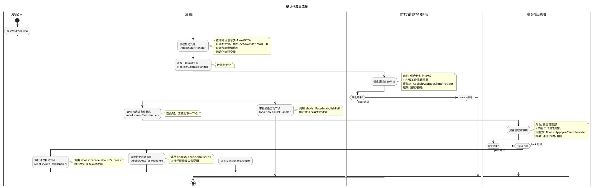

# 确认作废主流程业务文档

## 1. 业务概述

### 1.1 定义
确认作废主流程是供应链金融平台中用于处理凭证（电子信用凭证/应收账款凭证）作废申请的审批流程。当凭证需要作废时（如开立错误、业务取消等），需通过供应链财务BP审核和资金管理部审核的两级审批流程完成作废操作。

### 1.2 目标
- 规范凭证作废操作，防止未经审批的非法作废
- 两级审批机制（供应链财务BP→资金管理部）保障作废操作的合规性
- 自动化处理作废成功/失败后的状态变更及资产回退

### 1.3 价值
- 保障凭证生命周期管理的完整性
- 通过多级审批降低误操作风险
- 自动化通知相关方，提升协作效率

## 2. 业务流程

### 2.1 业务流程图

### 2.2 详细流程说明

#### 阶段一：流程启动
- 发起人提交凭证作废申请
- `AbolishStartHandler` 被触发：
  1. 解析 businessData 获取 tsAssetId 和 businessId
  2. 查询凭证详情（TsAssetDTO）：获取凭证编号、到期日、核心企业名称等
  3. 查询原始资产信息（AcflowAssetInfoDTO）：获取债权人、资产金额、债务人等
  4. 查询作废申请信息（TsAssetAbolishApplyDTO）：获取确认企业ID
  5. 初始化全部流程变量

#### 阶段二：流程开始自动节点
- `AbolishAutoTaskHandler` 在 `flow_start` 节点执行
- 当前为空处理（break），仅作为流程流转节点

#### 阶段三：供应链财务BP审核
- 审批角色：**供应链财务BP部**（ROLE-PLATFORM00059）+ **内管工作流管理员**
- 审批方切换：通过 `AbolishApprpveClientProvider` 动态确定审批人
- 审批结果：通过（pass）/ 拒绝（reject）

#### 阶段四：BP审核通过自动节点
- `AbolishAutoTaskHandler` 在 `fin_bp_audit_pass` 节点执行
- 当前为空处理，直接流转到资金管理部审核

#### 阶段五：资金管理部审核
- 审批角色：**资金管理部**（ROLE-PLATFORM00051）+ **内管工作流管理员**
- 审批方切换：通过 `AbolishApprpveClientProvider` 动态确定审批人
- 审批结果：通过（pass）/ 拒绝（reject）/ 退回（back）
- 退回时返回供应链财务BP审核节点重新审批

#### 阶段六：最终处理
- **通过**：`AbolishAutoTaskHandler` 在 `fin_manage_audit_pass` 节点调用 `abolishFacade.abolishSuccess(form)`
- **拒绝**：`AbolishAutoTaskHandler` 在 `audit_reject` 节点调用 `abolishFacade.abolishFail(form)`

## 3. 业务规则

### 3.1 约束条件
| 规则编号 | 规则描述 | 说明 |
|---------|---------|------|
| R001 | tsAssetId 必填 | 启动流程时businessData中必须包含凭证ID |
| R002 | businessId 必填 | 启动流程时businessData中必须包含业务ID |
| R003 | 凭证信息必须存在 | 根据tsAssetId能查到有效凭证 |

### 3.2 审批规则
| 规则编号 | 规则描述 | 说明 |
|---------|---------|------|
| R101 | 两级审批制 | 必须经过供应链财务BP + 资金管理部双重审批 |
| R102 | BP审核无退回 | 供应链财务BP审核仅支持通过/拒绝 |
| R103 | 资金管理部可退回 | 资金管理部审核支持通过/拒绝/退回 |
| R104 | 退回目标固定 | 退回仅可退至供应链财务BP审核节点 |

### 3.3 验证规则
- 作废申请必须关联有效凭证
- 确认企业ID需从作废申请记录获取
- 凭证到期日需格式化为 yyyy-MM-dd

## 4. 监听器说明

### 4.1 全局监听器

| 监听器 | 类型 | 说明 |
|--------|------|------|
| AbolishGlobalTaskNoticeHandler | 全局任务通知扩展 | 凭证作废全局任务通知事件监听 |
| AbolishStartHandler | 流程启动业务扩展 | 流程启动时查询凭证和资产信息，初始化流程变量 |

### 4.2 节点监听器

| 监听器 | 类型 | 绑定节点 | 说明 |
|--------|------|---------|------|
| AbolishAutoTaskHandler | 节点执行监听器 | flow_start、fin_bp_audit_pass、fin_manage_audit_pass、audit_reject | 根据节点ID分派不同处理逻辑 |
| AbolishApprpveClientProvider | 多级流转切换审批方 | fin_bp_audit、fin_manage_audit | 动态确定作废审批的审批人 |

### 4.3 监听器详细说明

#### AbolishStartHandler（流程启动）
- **触发时机**：流程启动
- **输入**：businessData（JSON格式，含tsAssetId和businessId）
- **核心逻辑**：
  1. 解析businessData获取tsAssetId和businessId
  2. 查询凭证信息：`tsAssetFacade.getTsAssetDetailById(tsAssetId)`
  3. 查询资产信息：`tsAssetFacade.getByAssetNo(assetNo)`
  4. 查询作废申请：`tsAssetAbolishApplyProvider.getById(businessId)`
  5. 构建流程变量：tsAssetNo、sellerName、assetNo、assetAmount、expireDate、abolishApplyDate、tsAssetId、assetId、coreCompanyName、confirmCompanyId、shareDeptName、fundsName、buyerName

#### AbolishAutoTaskHandler（自动节点处理）
- **触发时机**：各自动节点END事件
- **核心逻辑**：基于 `form.getElementKey()` 分支处理
  - `flow_start`：空处理
  - `fin_bp_audit_pass`：空处理
  - `fin_manage_audit_pass`：调用 `abolishFacade.abolishSuccess(form)` 执行作废成功逻辑
  - `audit_reject`：调用 `abolishFacade.abolishFail(form)` 执行作废失败逻辑

## 5. 状态管理

### 5.1 业务状态流转

| 当前状态 | 触发事件 | 目标状态 | 说明 |
|---------|---------|---------|------|
| 待审批 | 流程启动 | 审批中 | 提交作废申请 |
| 审批中 | 最终通过 | 已作废 | abolishSuccess执行作废 |
| 审批中 | 拒绝 | 作废失败 | abolishFail回退状态 |

### 5.2 状态转换规则
- 供应链财务BP审核通过后，凭证进入资金管理部审核阶段
- 资金管理部退回时，状态不变，回退至BP审核阶段
- 最终通过/拒绝由 `AbolishFacade` 的对应方法处理具体的状态更新和资产操作

### 5.3 异常处理
- 流程启动时如果查不到凭证或资产信息，流程启动失败
- 作废成功/失败处理中的异常由 `AbolishFacade` 内部处理

## 6. 消息通知

| 场景 | 触发时机 | 通知方式 | 说明 |
|------|---------|---------|------|
| 全局任务通知 | 任务创建/完成 | 站内信 | AbolishGlobalTaskNoticeHandler处理 |

具体通知模板和接收人由 `AbolishGlobalTaskNoticeHandler` 实现。

## 7. 配置项

| 配置项 | 说明 | 来源 |
|--------|------|------|
| 流程Key | Flow-fa7f1c36b2b94aa79528f47f8de64b40 | AbolishWorkFlowConstant.ASSET_ABOLISH_MAIN_FLOW |
| 流程类型 | 凭证作废 | 流程定义 |

### 业务扩展字段

| 字段名 | 存储位置 | 说明 |
|--------|---------|------|
| tsAssetNo | EXT1 | 凭证编号 |
| sellerName | EXT2 | 债权人 |
| assetNo | EXT3 | 原始资产编号 |
| assetAmount | EXT4 | 凭证金额 |
| expireDate | EXT5 | 凭证到期日 |
| abolishApplyDate | EXT6 | 作废申请日期 |
| tsAssetId | EXT7 | 凭证ID |
| assetId | EXT8 | 资产ID |
| coreCompanyName | EXT9 | 凭证开立方 |
| confirmCompanyId | EXT10 | 确认企业ID |
| shareDeptName | EXT11 | 共同债务人 |
| fundsName | EXT12 | 资金方名称 |
| buyerName | EXT13 | 债务人 |

### 全局变量

| 变量名 | 标签 | 默认值 | 说明 |
|--------|------|-------|------|
| launcher | 流程发起人 | default | 记录流程发起人 |
| currUser | 当前用户 | default | 当前操作用户 |
| formApproveResult | 审批结果 | default | 审批结果（pass/reject/back） |
| tsAssetId | 凭证id | 0 | 凭证ID |
| comfirmCompanyType | 确认方公司类型 | 0 | 确认方企业类型 |
| businessId | 业务id | 0 | 作废申请业务ID |
| applyAmount | 应付账款金额 | 0 | 应付账款金额 |

## 8. 注意事项

1. **两级审批差异**：供应链财务BP审核不支持退回操作，仅资金管理部支持退回
2. **审批方动态切换**：两个审批节点均使用 `AbolishApprpveClientProvider` 动态确定审批人，支持多级流转场景
3. **自动节点统一处理**：所有自动节点由同一个 `AbolishAutoTaskHandler` 处理，通过 elementKey 区分不同节点逻辑
4. **作废成功/失败处理**：具体的凭证状态变更、资产回退等操作封装在 `AbolishFacade` 中
5. **日期格式**：凭证到期日和作废申请日期统一使用 yyyy-MM-dd 格式
6. **确认企业**：作废流程中涉及确认企业（confirmCompanyId），用于确定凭证确认方
