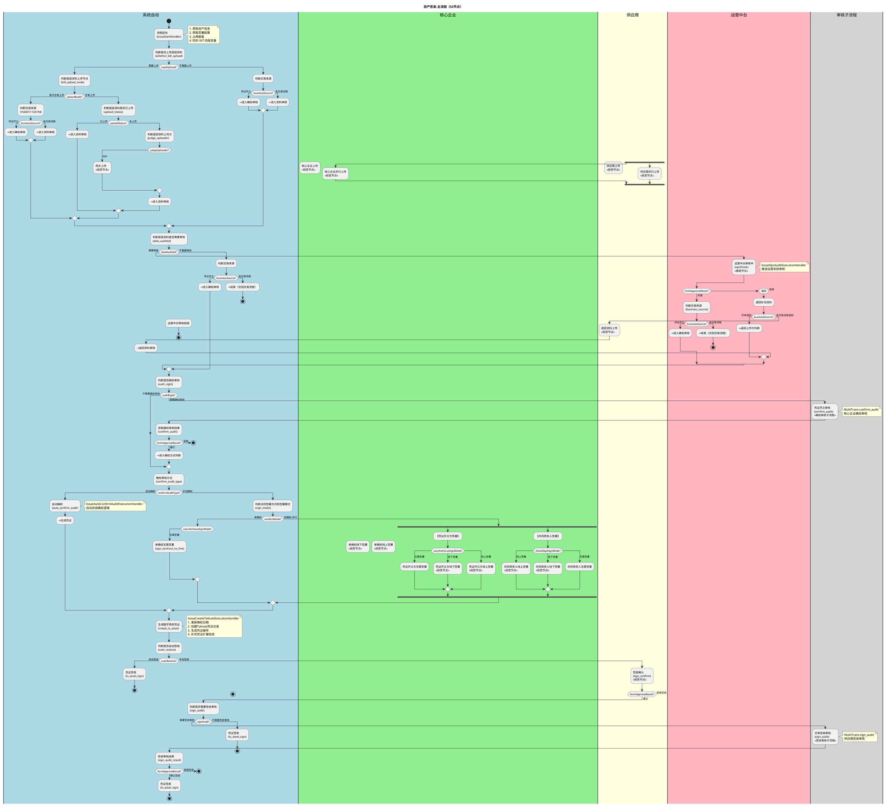

# 资产签发（凭证开立）业务文档

## 1. 业务概述

资产签发（凭证开立）是供应链金融平台的核心业务流程，主要用于将供应商对核心企业的应收账款转化为可流转的数字债权凭证。该流程涉及核心企业、供应商、运营中台等多方参与者，涵盖底层资料上传、资料审核、确权审核、合同签署、凭证生成和签收等关键环节。

- **流程Key**: `Flow-83da655977e34593962900df2dc3657c`
- **流程名称**: 资产签发-主流程
- **节点数量**: 53个
- **复杂度**: 极高
- **主要参与方**: 核心企业（含子公司/分公司/职能部门）、供应商、内管端（网关）、运营中台

## 2. 业务流程

### 2.1 业务流程图（PlantUML，含子流程平铺）



### 2.2 详细流程说明

#### 阶段一：流程启动
1. 用户发起凭证开立申请，触发 `IssueStartHandler`
2. 系统获取资产信息、签署配置，占用核企/共同债务人额度
3. 同步18个流程变量到工作流引擎

#### 阶段二：底层资料上传
1. 根据产品配置判断是否需要上传底层资料（`needUpload`）
2. 判断上传节点（`uploadNode`）：首次交易上传 / 开单上传
3. 判断上传方（`judgeUploader`）：核心企业/供应商/网关/并行上传
4. 支持退回补充资料场景，区分开单退回和交易流程退回

#### 阶段三：资料审核
1. 根据配置判断是否需要运营中台审核（`dataAudited`）
2. 运营中台审核支持三种结果：同意/退回补充资料/拒绝
3. 审核通过后根据交易来源（`businessSource`）决定后续路径

#### 阶段四：确权审核
1. 判断是否需要确权审核（`authRight`）
2. 确权审核方式（`confirmAuditType`）：自动确权/手动确权
3. 手动确权时根据确权模式（`confirmMode`）区分单确权/双确权
4. 合同签署方式（`voucherIssueSignMode`）：线上/线下/无需签署
5. 双确权模式下凭证开立方和共同债务人并行签署

#### 阶段五：凭证生成与签收
1. 生成数字债权凭证，分配凭证编号
2. 判断是否自动签收（`autoReceive`）
3. 手动签收需供应商确认，可配置签收审核子流程

## 3. 业务规则

### 3.1 额度管理规则
| 规则编号 | 规则描述 | 触发时机 |
|---------|---------|---------|
| R-IS-001 | 流程启动时占用核心企业额度 | IssueStartHandler → holdBillLimit |
| R-IS-002 | 存在共同债务人时同时占用共同债务人额度 | IssueStartHandler → holdShareBillLimit |
| R-IS-003 | 流程终止/拒绝时释放已占用额度 | IssueTerminalBussineessHandler → releaseBillLimit |

### 3.2 底层资料规则
| 规则编号 | 规则描述 | 条件 |
|---------|---------|------|
| R-IS-010 | 是否需要上传底层资料由产品参数控制 | needUpload = yes/no |
| R-IS-011 | 上传方支持：网关(agw)、核心企业(core)、供应商(supplier)、并行上传(all) | judgeUploader |
| R-IS-012 | 底层资料上传节点分为首次交易上传和开单上传 | uploadNode = transaction/issue |
| R-IS-013 | 退回补充资料时区分交易来源决定退回目标 | businessSource = issue/transaction |
| R-IS-014 | 不推送待办任务时直接跳过上传环节 | needPushAgentTasks = no |

### 3.3 确权审核规则
| 规则编号 | 规则描述 | 条件 |
|---------|---------|------|
| R-IS-020 | 确权审核方式分为自动确权和手动确权 | confirmAuditType = auto/manual |
| R-IS-021 | 自动确权由系统自动完成，不需要人工操作 | IssueAutoConfirmAuditExecutionHandler |
| R-IS-022 | 确权模式分为单确权和双确权（含共同债务人） | confirmMode = single/double |
| R-IS-023 | 双确权模式下凭证开立方和共同债务人并行签署 | 并行网关 Gateway |

### 3.4 合同签署规则
| 规则编号 | 规则描述 | 条件 |
|---------|---------|------|
| R-IS-030 | 合同签署方式：线上(on_line)、线下(off_line)、无需签署(no_line) | voucherIssueSignMode |
| R-IS-031 | 共同债务人签署方式独立配置 | shareDeptSignMode |
| R-IS-032 | 线上签署由核心企业授权人/签署人操作 | 抢签节点 |
| R-IS-033 | 线下签署由核心企业上传签署文件 | 抢签节点 |

### 3.5 凭证签收规则
| 规则编号 | 规则描述 | 条件 |
|---------|---------|------|
| R-IS-040 | 凭证签收支持自动签收和手动签收 | autoReceive = yes/no |
| R-IS-041 | 手动签收需要供应商确认，支持通过/拒绝 | 抢签节点 sign_confirm |
| R-IS-042 | 签收后可配置是否需要签收审核子流程 | signAudit = yes/no |
| R-IS-043 | 签收审核通过后凭证正式生效 | ts_asset_sign |

## 4. 接口说明/监听器说明

### 4.1 全局监听器

| 监听器 | 类型 | 说明 |
|--------|------|------|
| `IssueStartHandler` | 流程启动业务扩展 | 流程启动时初始化资产数据、占用额度、同步流程变量 |
| `IssueGlobalTaskNoticeHandler` | 全局任务通知扩展 | 全局任务通知：短信/站内信发送（5种通知类型） |
| `IssueTerminalBussineessHandler` | 流程终止业务扩展 | 流程终止清理：释放额度、删除临时凭证、删除文件 |

### 4.2 节点监听器

| 监听器 | 绑定节点 | 说明 |
|--------|---------|------|
| `IssueCommonExecutionHandler` | 14个自动节点 | 通用自动节点逻辑分发，根据nodeId执行不同业务逻辑 |
| `IssueUploadDataTaskListenerHandler` | 底层资料上传节点 | 处理上传任务创建和完成事件 |
| `IssueCommonApproveClientProvider` | 各审批/抢签节点 | 多级流转切换审批方，根据企业类型确定审批候选人 |
| `IssueAuthRightTaskListenerHandler` | 确权/签署合同节点 | 确权审核任务处理，发送确权通知短信 |
| `IssueCreateTsAssetExecutionHandler` | create_ts_asset | 生成数字债权凭证：创建记录、生成编号、补充扩展信息 |
| `IssueTsAssetSignExecutionHandler` | ts_asset_sign | 凭证签收完成：更新凭证和资产状态为已签收 |
| `IssueOpsAuditExecutionHandler` | opsCheck | 运营中台审核：接收运营系统审核结果回调 |
| `IssueAutoConfirmAuditExecutionHandler` | auto_confirm_audit | 自动确权逻辑处理 |
| `IssueConfirmAuditExecutionHandler` | confirm_audit | 获取确权审核子流程结果 |
| `IssueSignAuditExecutionHandler` | sign_audit_result | 获取签收审核子流程结果 |

### 4.3 子流程

| 子流程名称 | 流程Key | 触发节点 | 审批方 |
|-----------|---------|---------|--------|
| 确权审核子流程 | Flow-19463e2edffc4308b48e5d9edc13ef24 | MultiTrans-confirm_audit | 核心企业端(CORE_PC) |
| 开单签收审核子流程 | - | MultiTrans-sign_audit | 供应商端(SUPPLIER_PC) |

## 5. 状态管理

### 5.1 业务状态流转

```
资产状态:
  INIT(初始化) → UPLOAD_DATA(底层资料上传中) → DATA_AUDITING(资料审核中)
    → AUTH_RIGHT(确权中) → ISSUING(开立中) → SIGN_PENDING(签收中) → SIGNED(已签收)

凭证状态:
  INIT(初始化) → ISSUING(开立中) → SIGNED(已签收) → ACTIVE(生效)
```

### 5.2 状态转换规则

| 当前状态 | 触发事件 | 目标状态 | 触发节点 |
|---------|---------|---------|---------|
| - | 流程启动 | INIT | IssueStartHandler |
| INIT | 判断上传底层资料 | INIT | whether_bill_upload |
| INIT | 进入上传环节 | UPLOAD_DATA | judge_uploader |
| UPLOAD_DATA | 资料上传完成 | DATA_AUDITING | data_audited |
| DATA_AUDITING | 运营审核通过 | AUTH_RIGHT | business_source |
| AUTH_RIGHT | 确权审核通过 | ISSUING | sign_mode |
| ISSUING | 凭证生成完成 | SIGN_PENDING | create_ts_asset |
| SIGN_PENDING | 签收完成 | SIGNED | ts_asset_sign |

### 5.3 异常处理

| 异常场景 | 处理方式 | 触发监听器 |
|---------|---------|-----------|
| 流程终止/撤销 | 释放额度、删除临时凭证、删除付款确认文件 | IssueTerminalBussineessHandler |
| 运营审核拒绝 | 更新资产状态、释放相关资源 | IssueCommonExecutionHandler |
| 确权审核拒绝 | 流程结束，触发终止清理 | IssueTerminalBussineessHandler |
| 签收拒绝 | 流程结束，触发终止清理 | IssueTerminalBussineessHandler |
| 退回补充资料 | 区分交易来源，退回对应上传环节 | IssueCommonExecutionHandler |

## 6. 消息通知

### 6.1 短信通知

| 触发场景 | 接收方 | 通知内容 |
|---------|--------|---------|
| 核心企业签署合同 | 核心企业授权人 | 合同签署提醒 |
| 供应商签收确认 | 供应商授权人 | 凭证签收提醒 |
| 确权审核 | 核心企业授权人 | 确权审核提醒 |
| 退回补充资料 | 对应上传方 | 退回补充资料通知 |
| 拒绝/撤销 | 相关方 | 流程终止通知 |

### 6.2 站内信通知

| 触发场景 | 接收方 | 说明 |
|---------|--------|------|
| 子流程结束 | 核心企业/供应商 | 根据父流程节点确定通知对象 |
| 自动领取任务 | 任务负责人 | 合同签署/签收站内信 |
| 流程终止 | 相关方 | 撤销/拒绝签署通知 |

## 7. 配置项

### 7.1 全局流程变量

| 变量名 | 含义 | 默认值 | 可选值 |
|--------|------|--------|--------|
| needUpload | 是否需要上传底层资料 | yes | yes/no |
| uploadNode | 底层资料上传节点 | bill | issue/transaction |
| judgeUploader | 底层资料上传方 | core | core/supplier/agw/all |
| uploadStatus | 底层资料是否已上传 | yes | yes/no |
| dataAudited | 底层资料是否需要审核 | yes | yes/no |
| authRight | 资产确权是否需要审核 | yes | yes/no |
| confirmAuditType | 确权审核方式 | manual | auto/manual |
| confirmMode | 确权模式 | single | single/double |
| voucherIssueSignMode | 凭证开立签署模式 | on_line | on_line/off_line/no_line |
| shareDeptSignMode | 共同债务人签署模式 | on_line | on_line/off_line/no_line |
| autoReceive | 凭证是否自动签收 | no | yes/no |
| signAudit | 是否需要签收审核 | yes | yes/no |
| businessSource | 交易来源 | issue | issue/transaction |
| needPushAgentTasks | 是否推送待办任务 | yes | yes/no |
| signMode | 合同签署方式 | online | online/offline |
| needSign | 是否合同签署 | yes | yes/no |
| needDoubleConfirm | 是否需要双确权 | no | yes/no |

### 7.2 业务扩展元数据

| 扩展位 | 字段名 | 含义 |
|--------|--------|------|
| EXT1 | specialId | 业务ID |
| EXT2 | coreCompany | 核心企业名称 |
| EXT3 | coreCompanyId | 核心企业ID |
| EXT4 | supplierCompany | 供应商名称 |
| EXT5 | supplierCompanyId | 供应商ID |
| EXT6 | assetAmount | 凭证开立金额 |
| EXT7 | expireDate | 凭证到期日 |
| EXT9 | assetNo | 资产编号 |
| EXT14 | tsAssetId | 凭证ID |
| EXT15 | tsAssetNo | 凭证编号 |
| EXT16 | fundName | 资金方 |
| EXT17 | buyerName | 债务人 |
| EXT18 | shareDeptName | 共同债务人 |

## 8. 注意事项

1. **额度管理**：流程启动时占用额度，流程终止时必须释放额度，防止额度泄漏
2. **并行上传**：`judgeUploader=all` 时核心企业和供应商并行上传，两方均完成后才进入审核
3. **双确权模式**：凭证开立方和共同债务人通过并行网关同时签署，两方均完成后才生成凭证
4. **运营审核回调**：`ReceiveTask-opsCheck` 为异步等待节点，需要运营中台回调推进流程
5. **凭证编号生成**：凭证编号通过 `BusinessNoProvider.getBusinessNo` 生成，具有唯一性
6. **临时凭证清理**：流程终止时会删除 INIT 和 ISSUING 状态的临时凭证
7. **退回补充资料**：退回时需区分交易来源，开单退回返回上传方判断，交易流程退回返回供应商上传
8. **IssueCommonExecutionHandler 是热点文件**：承载14个自动节点的逻辑分发，修改时需特别注意节点ID匹配
