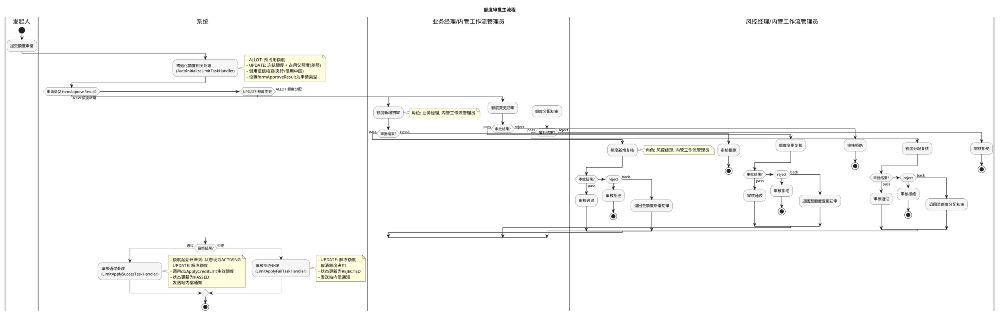

# 额度审批主流程业务文档

## 1. 业务概述

### 1.1 定义
额度审批主流程是供应链金融平台中用于管理授信额度全生命周期的核心审批流程。支持额度新增（NEW）、额度变更（UPDATE）和额度分配（ALLOT）三种业务类型，通过初审+复核的两级审批机制确保额度审批的合规性和准确性。

### 1.2 目标
- 实现额度新增、变更、分配的标准化审批
- 通过两级审批（初审+复核）机制保障风控质量
- 在审批过程中自动完成额度预占用、冻结等操作，保障额度数据一致性
- 审批完成后自动触发核查（央行征信、信用中国）及通知

### 1.3 价值
- 统一管理三种额度申请类型，降低运营复杂度
- 审批过程中自动锁定额度资源，防止超额分配
- 支持退回机制，允许审批人员灵活处理异常情况

## 2. 业务流程

### 2.1 业务流程图

### 2.2 详细流程说明

#### 阶段一：流程启动
- 发起人提交额度申请，触发 `LimitApplyProccessBusinessHandler`
- 从额度申请表查询申请信息（appNo、limitApplyNo、limitType、applyType等）
- 将关键业务数据写入流程变量

#### 阶段二：初始化处理
- `AutoInitializeLimitTaskHandler` 在流程开始后自动执行
- **额度分配（ALLOT）**：查询原额度信息，执行预占用（doOccupateCreditLimit）
- **额度变更（UPDATE）**：冻结原额度（freezeLimitInfo），若调整后大于原额度且有父额度则占用父额度差额
- 调用自动化核查：央行征信（necipsVerify）和信用中国（creditchinaVerify）
- 将申请类型设为 `formApproveResult` 以驱动后续分支

#### 阶段三：初审
- 根据申请类型路由至不同初审节点
- 初审角色：**业务经理** + **内管工作流管理员**
- `LimitFirstApproveTaskListenerHandler` 在初审提交时执行：
  - 通过时：更新扩展字段（审批金额、授信期限、日期等）；ALLOT重新占用额度；UPDATE处理冻结/解冻
  - 拒绝时：ALLOT/UPDATE取消额度占用
- 审批结果：pass（通过）/ reject（拒绝）

#### 阶段四：复核
- 复核角色：**风控经理** + **内管工作流管理员**
- 审批结果：pass（通过）/ reject（拒绝）/ back（退回至初审）

#### 阶段五：最终处理
- **通过**：`LimitApplySucessTaskHandler`
  - 额度起始日未到则设为ACTIVING状态
  - UPDATE类型解冻额度
  - 调用 `doApplyCreditLmt` 正式生效额度
  - 状态更新为 PASSED
  - 发送站内信给发起人、核心企业授权人、资金方授权人
- **拒绝**：`LimitApplyFailTaskHandler`
  - UPDATE类型解冻额度
  - 取消所有额度占用
  - 状态更新为 REJECTED
  - 发送站内信给发起人

## 3. 业务规则

### 3.1 约束条件
| 规则编号 | 规则描述 | 说明 |
|---------|---------|------|
| R001 | businessId 必填 | 启动流程时必须提供业务ID |
| R002 | businessData 必填 | 启动流程时必须提供业务数据 |
| R003 | 申请信息必须存在 | 根据businessId查询不到申请信息则抛异常 |

### 3.2 额度操作规则
| 规则编号 | 申请类型 | 初始化阶段 | 初审通过 | 最终通过 | 拒绝 |
|---------|---------|-----------|---------|---------|------|
| R101 | NEW（新增） | 仅核查 | 无额度操作 | 生效额度 | 无操作 |
| R102 | UPDATE（变更） | 冻结原额度 + 占用父额度差额 | 解冻+取消+重新占用+冻结 | 解冻 + 生效 | 解冻 + 取消占用 |
| R103 | ALLOT（分配） | 预占用额度 | 重新占用额度 | 生效额度 | 取消占用 |

### 3.3 验证规则
- 额度变更时，若调整金额 > 原额度金额且存在父额度，需占用父额度差额部分
- 额度金额计算精度为2位小数，使用 `RoundingMode.HALF_UP` 四舍五入
- 额度起始日在未来时，审批通过后状态为 ACTIVING（待激活），不立即生效

## 4. 监听器说明

### 4.1 全局监听器

| 监听器 | 类型 | 说明 |
|--------|------|------|
| LimitApplyProccessBusinessHandler | 流程启动业务扩展 | 流程启动时查询额度申请信息，初始化流程变量 |
| LimitGlobalTaskNoticeHandler | 全局任务通知扩展 | 任务创建/完成时发送全局通知 |

### 4.2 节点监听器

| 监听器 | 类型 | 绑定节点 | 说明 |
|--------|------|---------|------|
| AutoInitializeLimitTaskHandler | 节点执行监听器 | 初始化节点 | 额度预占用/冻结，调用自动化核查，设置分支变量 |
| LimitFirstApproveTaskListenerHandler | 任务监听器 | 三条分支初审节点 | 初审提交时更新扩展字段，处理额度占用/取消 |
| LimitApplyFailTaskHandler | 节点执行监听器 | 审核拒绝节点 | 解冻额度、取消占用、更新状态为REJECTED、发送通知 |
| LimitApplySucessTaskHandler | 节点执行监听器 | 审核通过节点 | 解冻额度、生效额度、更新状态为PASSED、发送通知 |

### 4.3 监听器详细说明

#### LimitApplyProccessBusinessHandler（流程启动）
- **触发时机**：流程启动
- **输入**：businessId（额度申请ID）、businessData
- **核心逻辑**：
  1. 查询额度申请信息（LimitApplyFacade.getById）
  2. 构建流程变量：appNo、limitApplyNo、limitType、applyType、custName、custType、fundName、applyStatus、aprovalAmount、creditPeriod、beginDate、expireDate、comCustName
  3. 返回变量和businessId

#### AutoInitializeLimitTaskHandler（初始化）
- **触发时机**：初始化节点END事件
- **核心逻辑**：
  1. ALLOT类型：查询原额度信息 → 预占用额度
  2. UPDATE类型：更新申请金额 → 冻结原额度 → 有父额度且金额增加时占用父额度差额
  3. 调用央行征信核查和信用中国核查
  4. 设置 `formApproveResult` 为申请类型驱动分支路由

#### LimitFirstApproveTaskListenerHandler（初审）
- **触发时机**：初审任务COMPLETE事件
- **核心逻辑**：
  - 通过时：更新扩展字段（审批金额、期限、日期）；ALLOT重新占用；UPDATE处理冻结解冻
  - 拒绝时：ALLOT/UPDATE取消占用

## 5. 状态管理

### 5.1 业务状态流转

| 当前状态 | 触发事件 | 目标状态 | 说明 |
|---------|---------|---------|------|
| 待审批 | 流程启动 | 审批中 | 发起额度申请 |
| 审批中 | 最终通过（起始日已到） | PASSED（已通过） | 额度立即生效 |
| 审批中 | 最终通过（起始日未到） | ACTIVING（待激活） | 额度待激活，到期自动生效 |
| 审批中 | 最终拒绝 | REJECTED（已拒绝） | 额度审批被拒 |

### 5.2 状态转换规则
- 初审和复核环节不改变业务状态，仅在最终通过/拒绝节点变更
- ACTIVING状态的额度在起始日到达后自动转为生效状态
- 拒绝后自动清理占用/冻结的额度资源

### 5.3 异常处理
- 自动化核查异常不阻塞流程，仅记录错误日志
- 站内信发送异常不阻塞流程，仅记录错误日志
- 额度操作异常会导致流程中断，需人工介入处理

## 6. 消息通知

| 场景编码 | 触发时机 | 通知对象 | 说明 |
|---------|---------|---------|------|
| LIMIT_03 | 审批通过 | 内管发起人 | 额度申请通过通知 |
| LIMIT_04 | 审批拒绝 | 内管发起人 | 额度申请拒绝通知，包含拒绝原因 |
| LIMIT_06 | 审批通过 | 核心企业授权人 | 额度通过通知核心企业 |
| LIMIT_07 | 审批通过 | 资金方授权人 | 额度通过通知资金方 |

通知参数包括：companyName（企业名称）、applyType（申请类型）、limitTypeName（额度类型名称）、taskName（节点名称）、reason（拒绝原因，仅拒绝时）。

## 7. 配置项

| 配置项 | 说明 | 来源 |
|--------|------|------|
| 流程Key | Flow-3ed91cd2258c4ffc93ac3239118ff4b7 | LimitWorkFlowConstant.LIMIT_MAIN_FLOW |
| 流程类型 | 授信审批流程 | 流程定义 |
| 审批表单 | 多个自定义表单（不同节点不同表单） | 流程定义 formCode |
| WorkflowNacosConfig | 默认企业名称、企业类型等 | Nacos配置 |

### 业务扩展字段

| 字段名 | 存储位置 | 说明 |
|--------|---------|------|
| appNo | EXT1 | 授信申请编号 |
| limitApplyNo | EXT2 | 申请额度编号 |
| limitType | EXT3 | 额度类型 |
| applyType | EXT4 | 额度申请类型 |
| custName | EXT5 | 授信企业名称 |
| custType | EXT6 | 授信企业类型 |
| fundName | EXT7 | 资金方 |
| applyStatus | EXT8 | 额度申请状态 |
| aprovalAmount | EXT9 | 申请金额 |
| creditPeriod | EXT10 | 授信期限 |
| beginDate | EXT11 | 授信起始日 |
| expireDate | EXT12 | 额度到期日 |
| comCustName | EXT30 | 首页名称 |

## 8. 注意事项

1. **额度一致性**：初始化阶段的额度预占用/冻结操作与最终通过/拒绝的释放操作必须配对，否则会导致额度数据不一致
2. **并发控制**：同一企业的多个额度申请可能存在并发占用的情况，需确保额度服务层面的并发安全
3. **金额精度**：所有金额计算使用 BigDecimal，scale=2，RoundingMode.HALF_UP
4. **核查异步化**：央行征信和信用中国核查采用try-catch包裹，失败不影响主流程
5. **退回机制**：仅复核环节支持退回（back），退回后回到同分支的初审节点重新审批
6. **角色配置**：初审角色为业务经理+内管工作流管理员，复核角色为风控经理+内管工作流管理员
7. **站内信发送**：使用IntStream.range(0,10)创建通知接收人，实际只需要一个接收人即可（代码存在冗余）
